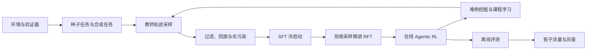
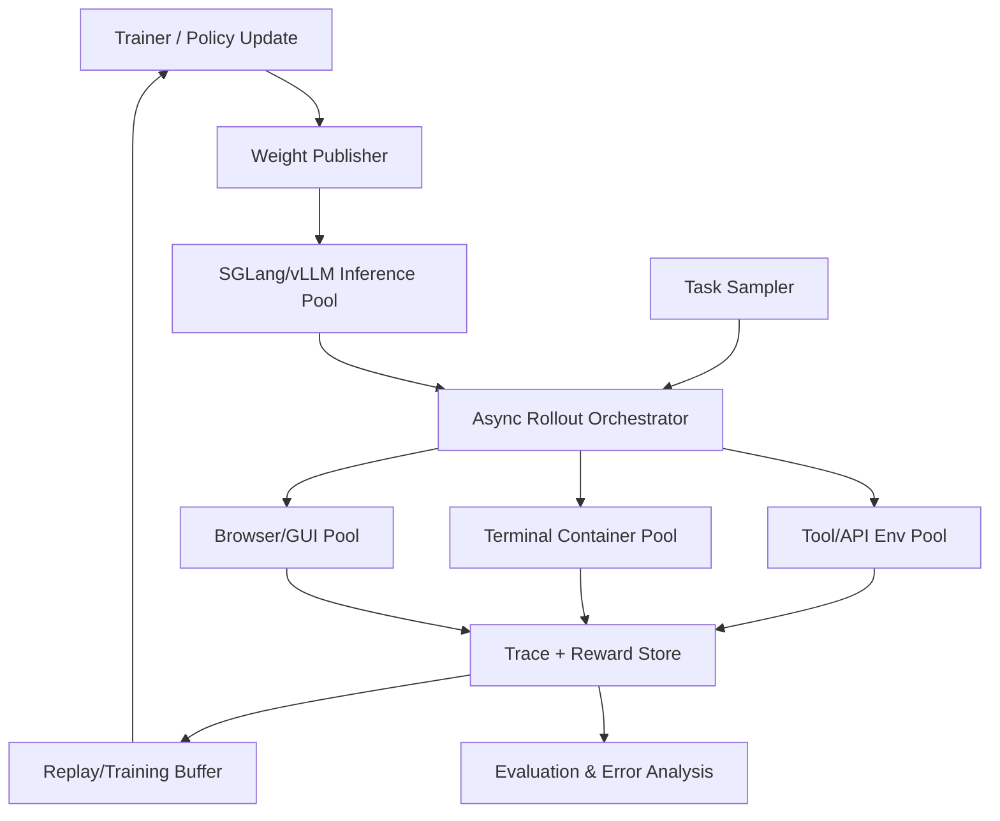

# Agentic RL 技术调研与训练方案

> 文档版本：v1.0  
> 调研日期：2026-06-09  
> 项目状态：空仓库起步，本文同时作为技术选型、实施蓝图和验收依据  
> 目标读者：算法、训练平台、Agent 工程、数据和评测团队

## 1. 执行摘要

### 1.1 核心判断

Agentic RL 不是把单轮问答的 GRPO 直接套到 Agent 上。它本质上是一个长时序、
部分可观测、环境反馈异步且奖励稀疏的决策问题。真正决定效果的通常不是某一个
策略优化公式，而是以下系统能力能否同时成立：

1. 环境可重置、可并行、可验证，训练和评测状态严格隔离。
2. 每一步模型调用、工具调用、环境状态变化和 token 概率都能完整追踪。
3. 数据覆盖成功、失败、恢复、拒绝调用、无效工具和长尾环境状态。
4. 奖励以确定性验证器为主，LLM Judge 只处理无法程序化验证的部分。
5. 多轮 rollout 与训练解耦并异步执行，避免工具和环境等待导致 GPU 空转。
6. 先通过 SFT 建立格式、工具协议和基本策略，再逐步引入在线 RL。
7. 同时评测任务成功率、成本、稳定性、安全性和跨环境泛化，而非只看平均 reward。

### 1.2 推荐主线

本项目建议采用“一条主线、两级验证、逐域扩展”的路线：

| 层级 | 推荐方案 | 用途 |
|---|---|---|
| CPT/mid-training 后端 | `TorchTitan` | Qwen3 1.7B 全参数持续预训练、FSDP2、DCP checkpoint |
| Agentic RL 后端 | `verl` + `SGLang`，备选 `vLLM` | 多机多卡、异步多轮 rollout、GRPO/DAPO/PPO |
| Agent 环境层 | 自研 Gymnasium 风格协议 + 适配器 | 隔离 Agent 框架，统一训练与评测 |
| 轻量算法验证 | Hugging Face `TRL` | 单机/小规模工具调用实验 |
| 已有 Agent 接入 | `Agent Lightning` 或 `rLLM` | 尽量少改 LangGraph/OpenAI SDK 等业务 Agent |
| 首个训练域 | 文本工具调用 + 可执行 API 沙箱 | 成本低、验证器确定、迭代快 |
| 第二训练域 | Terminal/代码 Agent | 可用测试和补丁验证，适合 RLVR |
| 后续扩展 | Web/GUI | 环境维护和 rollout 成本高，放在基础设施稳定后 |
| 默认起始模型 | 1.7B-2B 开源 Base 模型 | 先建立可重复的小模型预训练、SFT、RL 闭环 |

不建议一开始直接训练 32B/70B，也不建议把 WebArena、OSWorld 作为第一个训练环境。
这两类环境的启动、复位、并发和判分成本会掩盖算法问题。

### 1.3 建议训练阶段



建议的首版闭环为：

- 2,000 至 10,000 个可验证任务。
- 每个任务采样 4 至 16 条轨迹。
- 先保留高质量成功轨迹做 SFT。
- 用 SFT 模型做第二轮采样和拒绝采样微调。
- 最后用 GRPO/DAPO 类方法进行在线 RL。
- 每次更新固定跑独立测试集和至少 3 个随机种子。

## 2. 范围与目标

### 2.1 Agentic RL 定义

普通 LLM 后训练通常将一次提示到一次回答视为单步决策。Agentic RL 将模型放入
持续变化的环境中，模型需要多轮观察、思考、行动、调用工具、处理错误并决定何时
终止。形式上更接近 POMDP：

- 状态 `s_t`：环境真实状态，模型通常无法完全观察。
- 观察 `o_t`：工具返回、页面、终端输出、用户消息和记忆摘要。
- 动作 `a_t`：自然语言、结构化工具调用、代码、点击或终止。
- 转移 `P(s_{t+1}|s_t,a_t)`：由外部环境执行。
- 奖励 `r_t`：步骤级反馈和最终任务结果。
- 轨迹 `tau=(o_0,a_0,r_0,...,o_T,a_T,r_T)`。

优化目标不只是答案正确率，而是：

`J = E_tau[task_success - lambda_c * cost - lambda_r * risk - lambda_l * latency]`

其中权重必须由产品约束决定，不能在训练后临时补上。

### 2.2 本项目目标

第一阶段建设一个可扩展的通用 Agentic RL 平台，支持：

- OpenAI 风格 function calling 和 MCP 风格工具描述。
- 文本 API、Python/终端、浏览器和 GUI 环境适配。
- 单 Agent、多 Agent 和用户模拟器交互。
- 轨迹级、步骤级和 token 级奖励。
- SFT、拒绝采样、GRPO/DAPO、PPO 和离线偏好训练。
- 确定性验证器、规则奖励、模型奖励和人工审计。
- 训练、回放、评测、错误分析和数据回流的统一 trace。

### 2.3 非目标

首版不追求：

- 在 4×H800 条件下从随机初始化复刻需要数万 GPU 日的通用预训练；首版采用
  开源 Base 权重上的持续预训练/中期训练。
- 同时覆盖所有 Agent 场景。
- 用不可解释的单一 LLM Judge 代替业务验收。
- 在没有稳定评测基线前追求大规模集群吞吐。
- 依赖私有推理过程作为唯一训练标签。

## 3. 业界方案全景

### 3.1 训练框架

预训练/CPT 与在线 Agentic RL 的系统瓶颈不同，不建议用一个框架强行覆盖全部阶段。
本项目在 2B、单节点 4×H800 条件下，CPT 主选 TorchTitan，在线 RL 主选 verl。
详细的预训练框架评分、配置和首次实测见
`docs/training_framework_selection_and_smoke.md`。

#### 3.1.0 TorchTitan、Megatron 与通用微调框架

TorchTitan 当前环境已安装，原生支持 Qwen3 0.6B/1.7B、FSDP2、TP/PP/CP、
Distributed Checkpoint 和 Hugging Face state-dict adapter。对 2B、4 卡实验，
其可控性、部署成本和 PyTorch 版本一致性优于 Megatron-LM，因此选为 CPT 主后端。

Megatron-LM 在多节点、30B+ 和复杂 3D/4D 并行场景仍是强候选，但当前规模下转换、
安装和排障成本无法由吞吐收益抵消。Transformers/DeepSpeed、LLaMA-Factory 和
ms-swift 适合 SFT/LoRA、数据配方和新架构兼容验证，不作为核心 CPT 后端。

#### 3.1.1 verl

`verl` 是当前最适合作为本项目在线 Agentic RL 主后端的方案。它支持 FSDP/FSDP2、
Megatron-LM、SGLang、vLLM、多种策略优化算法，以及多轮工具调用和异步
AgentLoop。其关键价值是把训练计算和 rollout 计算解耦，并通过服务化异步
rollout 减少长尾工具调用造成的 GPU 空闲。

优势：

- 分布式能力和算法覆盖完整。
- 支持函数奖励和可验证奖励。
- 支持多轮工具调用、Agent loop 和 rollout trace。
- 社区已出现 Agent-R1、RAGEN、verl-agent 等 Agentic RL 扩展。

局限：

- 配置和分布式调试复杂。
- 版本演进较快，项目需要锁定 commit 和兼容矩阵。
- 自定义环境仍需定义清晰的数据、状态和奖励接口。

结论：生产训练主选。

#### 3.1.2 Hugging Face TRL

TRL 的 `GRPOTrainer` 已支持通过 `tools` 参数训练工具调用 Agent，适合快速验证
奖励、聊天模板、采样参数和小模型训练。

优势：

- API 简单，Hugging Face 生态集成好。
- 适合单机和小规模 LoRA 实验。
- 便于写最小可复现实验。

局限：

- 复杂长时序环境和大规模异步 rollout 不是其最强项。
- 多角色、多环境池、长尾调度需要额外工程。

结论：算法 PoC 和单元实验主选，不作为长期大规模后端。

#### 3.1.3 OpenRLHF

OpenRLHF 基于 Ray、vLLM 和 DeepSpeed，支持 PPO、GRPO、REINFORCE++、动态采样
和异步 Agentic RL。

优势：

- Ray 调度成熟，RLHF 训练性能较强。
- PPO 工程经验和混合部署能力完整。

局限：

- Agent 环境抽象和多轮生态相对 `verl` 不占明显优势。
- 若团队已经统一采用 FSDP/Megatron，迁移收益有限。

结论：团队已有 DeepSpeed/Ray 资产时作为强备选。

#### 3.1.4 SkyRL / SkyRL-Agent

SkyRL 定位为模块化全栈 RL 库，并提供长时序 Agent 训练层。其 Agent 工作强调
高效多轮 rollout 和真实软件工程环境训练。

结论：值得跟踪和对照测试，但首版不建议同时维护第二套分布式后端。

#### 3.1.5 Agent Lightning

Agent Lightning 将业务 Agent 与训练系统解耦，支持 LangGraph、OpenAI Agents
SDK、AutoGen 等框架，并可选择性优化多 Agent 系统中的部分 Agent。

优势：

- 对既有 Agent 代码侵入较小。
- 适合真实业务 Agent 的 trace 收集和训练接入。
- 同时支持 RL、SFT 和提示优化。

局限：

- 对底层训练行为和数据契约的控制不如直接使用 `verl`。
- 引入额外抽象层，排障时需区分业务 Agent、追踪层和训练后端。

结论：已有复杂 Agent 产品时采用；新项目仍应先定义自己的环境协议。

#### 3.1.6 rLLM

rLLM 强调用装饰器追踪任意 Agent 框架，并提供 `verl` 等训练后端和内置基准。
适合快速把现有 Agent 变成可训练 rollout。

结论：可作为接入层候选，需重点验证 token ID、logprob、工具消息模板和多轮
上下文是否无漂移。

#### 3.1.7 框架选型矩阵

| 方案 | 轻量 PoC | 大规模训练 | 多轮 Agent | 既有 Agent 接入 | 推荐角色 |
|---|---:|---:|---:|---:|---|
| verl | 中 | 强 | 强 | 中 | 主训练后端 |
| TRL | 强 | 中 | 中 | 中 | 快速实验 |
| OpenRLHF | 中 | 强 | 中/强 | 中 | Ray/DeepSpeed 备选 |
| SkyRL | 中 | 强 | 强 | 中 | 跟踪与专项验证 |
| Agent Lightning | 强 | 依赖后端 | 强 | 强 | 业务 Agent 接入 |
| rLLM | 强 | 依赖后端 | 强 | 强 | 轻接入与基准实验 |

### 3.2 主流训练算法

#### 3.2.1 SFT 与轨迹模仿

SFT 不是 Agentic RL 的替代品，但通常是必需的冷启动阶段。它负责学习：

- 工具调用 JSON/模板格式。
- 何时调用、何时不调用工具。
- 观察到行动的基本映射。
- 错误恢复、澄清和终止行为。
- Agent 框架规定的消息角色和上下文组织。

SFT 的主要风险是行为克隆上限、暴露偏差和只学习教师的表面轨迹。应混入失败恢复、
负例和同任务多路径轨迹，并在后续通过在线环境训练纠正。

#### 3.2.2 拒绝采样微调

对每个任务采样多个 rollout，用确定性验证器筛选成功轨迹，再做 SFT。SWE-Gym 等
工作显示，少量高质量 Agent 轨迹也能带来显著增益。

适用场景：

- 成功轨迹稀缺但验证器可靠。
- 在线 RL 基础设施尚未稳定。
- 需要先提高成功率以避免 RL 全零奖励。

局限：

- 只学习成功样本，不直接利用失败轨迹中的局部正确信息。
- 容易偏向短期能被当前策略采到的任务。

#### 3.2.3 PPO

PPO 使用价值模型或 critic 估计优势，能够进行步骤级信用分配，理论上适合长时序
Agent。代价是需要额外模型、显存和调参，critic 在稀疏奖励与非平稳环境中也可能
不稳定。

建议：当任务时长较长、步骤奖励可靠且有足够算力时使用；不作为首个基线。

#### 3.2.4 GRPO

GRPO 对同一任务采样一组轨迹，通过组内奖励相对值估计优势，省去 critic。它非常
适合有确定性最终奖励的 RLVR 场景。

优点：

- 实现和显存成本低于 PPO。
- 与并行 best-of-N rollout 自然匹配。
- 数学、代码、工具调用等可验证任务上已有广泛应用。

风险：

- 同组奖励全相同则没有有效梯度。
- 稀疏奖励下需要较大组采样，rollout 成本高。
- 原始长度归一化可能造成不期望的输出变长偏差。
- 轨迹级奖励难以区分多轮中具体哪一步有贡献。

#### 3.2.5 DAPO / Dr.GRPO

DAPO 在 GRPO 类训练上引入解耦裁剪、动态采样、token 级损失和过长响应处理，核心
工程启示是：

- 过滤或重采样组内全对/全错任务，维持有效 reward 方差。
- 对正向更新保留更大的上界，减少熵过早坍塌。
- 使用 token 级聚合，减轻样本长度偏差。
- 对超长轨迹渐进惩罚，而非简单截断后误判。

Dr.GRPO 指出 GRPO 中可能存在长度偏置，并给出更无偏的归一化方式。

建议：首版以 GRPO 建立正确性基线，稳定后采用 DAPO/Dr.GRPO 的关键改进，不要在
第一轮同时打开所有技巧。

#### 3.2.6 StarPO / GiGPO / StepPO

Agent 特有问题是多轮信用分配：

- RAGEN/StarPO 将 Agent 轨迹作为核心优化对象，并报告 reward variance cliff、
  gradient spike 和 Echo Trap 等问题。
- GiGPO 同时构建轨迹组和步骤组优势，在保持无 critic 的同时进行更细粒度信用分配。
- StepPO 类方法将每一步交互视为更明确的转移，利用步骤奖励或回溯奖励训练。

建议：这些方法作为第二阶段研究项。只有当 trace、步骤状态和步骤验证器可靠时，
细粒度算法才会优于简单轨迹级 GRPO。

#### 3.2.7 算法采用顺序

| 阶段 | 算法 | 进入条件 |
|---|---|---|
| P0 | SFT | 工具协议和轨迹 schema 通过回放测试 |
| P1 | 拒绝采样微调 | 验证器精度达到 98% 以上 |
| P2 | GRPO | SFT 策略在训练集成功率建议达到 10% 以上 |
| P3 | DAPO/Dr.GRPO 技巧 | 已有稳定 GRPO 曲线和消融基线 |
| P4 | GiGPO/Step-level RL | 步骤奖励与状态边界经过人工审计 |
| P5 | PPO 或混合 critic | 长时序信用分配仍是主要瓶颈 |

## 4. 数据准备方案

### 4.1 数据分层

建议将数据分成五层，而不是只维护一个对话 JSONL：

| 层 | 内容 | 是否含模型输出 | 主要用途 |
|---|---|---:|---|
| Task | 任务、初始状态、工具、验收规则 | 否 | 训练采样和评测 |
| Episode | 一次完整环境运行 | 是 | RL 与结果分析 |
| Step | 单次观察、动作、反馈 | 是 | 信用分配和回放 |
| Token | token id、mask、logprob、版本 | 是 | 策略更新 |
| Artifact | 文件、补丁、截图、数据库快照 | 可选 | 确定性验证 |

必须区分“任务数据”和“轨迹数据”。任务可以重复采样，轨迹必须带策略版本和环境
版本，否则无法复现 reward。

### 4.2 统一任务 schema

```json
{
  "task_id": "tool_sql_000123",
  "domain": "tool_api",
  "split": "train",
  "instruction": "统计过去 30 天退款订单总额",
  "initial_state_ref": "snapshot://retail/v3/000123",
  "tools_ref": "tools://retail/v3",
  "policy_ref": "policy://retail/v2",
  "max_steps": 12,
  "time_limit_s": 180,
  "grader": {
    "type": "state_assertion",
    "spec_ref": "grader://retail/refund_sum/v1"
  },
  "metadata": {
    "difficulty": 2,
    "skills": ["tool_selection", "sql", "aggregation"],
    "source": "synthetic_verified",
    "license": "internal"
  }
}
```

### 4.3 统一轨迹 schema

```json
{
  "episode_id": "ep_01J...",
  "task_id": "tool_sql_000123",
  "policy": {
    "model": "agentic-rl-2b-sft",
    "revision": "sha256:...",
    "chat_template": "qwen_tool_v2",
    "sampling": {"temperature": 0.8, "top_p": 0.95}
  },
  "environment": {
    "name": "retail_api",
    "version": "3.1.0",
    "seed": 42,
    "snapshot_hash": "sha256:..."
  },
  "steps": [
    {
      "step_id": 0,
      "observation": [{"type": "text", "content": "..."}],
      "action": {
        "type": "tool_call",
        "name": "query_orders",
        "arguments": {"days": 30, "status": "refunded"}
      },
      "tool_result": {"rows": 18},
      "reward": {
        "format": 1.0,
        "tool_validity": 1.0,
        "progress": 0.2
      },
      "terminated": false,
      "token_span": {"start": 0, "end": 85}
    }
  ],
  "final_reward": 1.0,
  "grader_result": {"passed": true, "details": {}},
  "cost": {
    "input_tokens": 2410,
    "output_tokens": 522,
    "tool_calls": 3,
    "wall_time_s": 8.4
  }
}
```

### 4.4 数据来源

#### 4.4.1 公共数据

可用于预热和格式训练的数据包括：

- ToolBench：大规模真实 API 工具学习数据。
- APIGen/xLAM function-calling：经过格式、执行和语义三级验证的函数调用数据。
- AgentInstruct/AgentTuning：多环境交互轨迹。
- SWE-Gym：真实软件工程任务、环境和轨迹。
- R2E-Gym、SWE-RL：代码环境生成和软件演化数据。

公共数据只用于预热。工具 schema、消息模板和业务策略与目标环境不一致时，直接
混训可能造成旧工具名、错误参数和停止策略污染。

#### 4.4.2 真实业务 trace

真实 trace 对分布拟合价值最高，但必须经过：

- 隐私和敏感信息脱敏。
- 用户授权、用途和保留周期审查。
- 工具版本归一化。
- 结果状态重放验证。
- 去除人工接管后被错误标为模型成功的轨迹。
- 防止测试集任务和答案进入训练集。

#### 4.4.3 合成数据

推荐采用 APIGen 风格的可执行生成流水线：

1. 从工具 schema、策略文档和环境状态采样种子。
2. 生成目标、约束、歧义和异常条件。
3. 用强教师 Agent 生成多条候选轨迹。
4. 执行工具并回放环境，不接受纯文本伪造结果。
5. 用确定性 verifier 校验最终状态。
6. 用规则和独立模型检查语义、难度、泄漏和多样性。
7. 保留成功轨迹、关键失败轨迹和恢复轨迹。

不要只生成“理想成功轨迹”。至少应包含：

- 无合适工具时正确拒绝调用。
- 参数缺失时向用户澄清。
- 工具超时、空结果、权限失败和部分失败。
- 相似工具之间的选择。
- 重复调用、循环和提前终止负例。
- 用户中途改变目标。
- 策略约束与用户诉求冲突。

### 4.5 数据质量门槛

每批数据进入训练前建议满足：

| 检查项 | 建议门槛 |
|---|---:|
| schema 解析成功率 | 100% |
| 工具调用可执行率 | >= 99.5% |
| 环境可重放率 | >= 99% |
| verifier 与人工一致率 | >= 98% |
| train/test 近重复率 | < 0.1% |
| 不同任务模板占比 | 单模板不超过 5% |
| 成功轨迹人工抽检通过率 | >= 95% |
| 敏感信息扫描 | 0 个未处置高风险项 |

去重至少同时使用：

- 指令文本 MinHash/SimHash。
- 任务结构签名：工具序列、参数类型、状态变更。
- 代码任务的仓库、commit、issue 和测试签名。
- 语义 embedding 近邻检查。

数据切分应按“任务族、仓库、网站模板或业务实体”分组，而不是随机按行切分。

### 4.6 课程学习

推荐按可验证难度分层：

1. 单工具、单步、参数完整。
2. 多工具、顺序调用、确定性反馈。
3. 多轮澄清、错误恢复和策略约束。
4. 长时序、部分可观测和延迟奖励。
5. 新工具组合、分布外状态和对抗输入。

训练池动态维持三类样本：

- 20% 容易样本：防止遗忘和保持格式。
- 60% 边界样本：当前成功率约 20% 至 80%，提供最大训练信号。
- 20% 困难/新颖样本：推动泛化，但不让全零 reward 主导训练。

## 5. 环境与 Rollout 系统

### 5.1 环境协议

环境接口应接近 Gymnasium，但保留 Agent 所需的结构化消息和 artifact：

```python
class AgentEnvironment(Protocol):
    async def reset(self, task, seed: int) -> Observation: ...
    async def step(self, action: AgentAction) -> StepResult: ...
    async def snapshot(self) -> StateRef: ...
    async def restore(self, state: StateRef) -> None: ...
    async def grade(self) -> GradeResult: ...
    async def close(self) -> None: ...
```

`StepResult` 至少包含：

- 新观察。
- 步骤奖励及各分量。
- `terminated` 和 `truncated`。
- 环境状态摘要和 artifact 引用。
- 错误类型、耗时、重试次数。

### 5.2 Rollout 架构



关键设计：

- 推理服务和环境执行分离。
- rollout worker 不持有训练模型权重，只访问版本化推理端点。
- 每个 episode 固定模型版本，禁止中途切换权重。
- 权重发布采用原子版本切换。
- 工具结果进入上下文前记录原始值和序列化值。
- token ID 由推理端返回，避免服务端与训练端重新分词漂移。
- 对超时、环境故障和模型失败使用不同终止码。

### 5.3 并发与吞吐

Agent rollout 的瓶颈常在环境而非模型。建议：

- API/文本环境使用 `asyncio` 高并发。
- Terminal 使用预热容器池和镜像分层缓存。
- Browser 使用可重置 profile 和站点快照。
- GUI 环境按状态复位成本设置独立队列。
- 按预计 episode 时长分桶，减少同 batch 长尾。
- 对同一任务的 group rollout 分散到不同 worker。

核心吞吐指标：

- `episodes/hour`。
- `useful_tokens/GPU-second`。
- 环境等待占比。
- 推理服务 batch 利用率。
- P50/P95 episode 时长。
- 因环境故障丢弃的轨迹比例。
- 策略版本陈旧度。

## 6. 奖励与信用分配

### 6.1 奖励组成

首版建议：

`R = 1.0*R_success + 0.2*R_progress + 0.1*R_format + 0.1*R_policy - 0.05*R_cost - 0.2*R_invalid`

这只是初始模板，所有分量必须记录原值，训练时再配置权重。

#### 最终成功奖励

优先级：

1. 单元测试、数据库状态、文件 hash、API 状态等确定性验证。
2. 结构化字段比较和容差数值比较。
3. 独立规则引擎。
4. 多 Judge 共识。
5. 单一 LLM Judge。

#### 步骤奖励

可来自：

- 调用格式合法。
- 工具选择正确。
- 参数满足 schema。
- 状态距离目标更近。
- 通过子测试。
- 首次错误后成功恢复。

步骤奖励不能泄漏隐藏答案。例如把“正确工具名”硬编码为奖励，可能让模型学习
捷径，而不是从观察中决策。

#### 成本奖励

建议只使用小权重或约束优化，避免模型为省 token 直接提前终止：

- token 数。
- 工具调用次数。
- 重复调用。
- wall-clock 延迟。
- 沙箱 CPU/GPU/网络成本。

### 6.2 Reward Hacking 防护

至少覆盖：

- 最终答案正确但没有执行必要状态变更。
- 修改测试或 grader 使失败变成功。
- 利用网络访问隐藏答案。
- 在工具参数或输出中注入 grader 指令。
- 重复调用累积正步骤奖励。
- 达成局部目标后破坏已有状态。
- 通过超时或异常让 verifier 错误放行。

措施：

- grader 运行在独立只读环境。
- 测试和 oracle 对策略不可见。
- 奖励按状态差异判定，不信任模型自报。
- 步骤正奖励设置上限，并以最终成功为门控。
- 对高 reward 轨迹进行自动异常检测和人工抽检。

### 6.3 信用分配策略

建议分三阶段：

1. 轨迹级 GRPO：所有生成 token 共享最终优势，建立稳定基线。
2. 分段优势：按 Agent step 将奖励回传到对应响应 token。
3. GiGPO/critic：当长时序任务成为主要瓶颈后再引入。

对多轮轨迹，必须明确哪些 token 参与 loss：

- 模型生成的 reasoning/action token：通常参与。
- system/user/tool observation token：mask。
- 环境自动插入的错误消息：mask。
- 多 Agent 中非目标 Agent 的 token：mask。
- 被截断后无法判定的尾部：单独 mask 或降权。

## 7. 训练方案

### 7.1 轻量模型目标与竞争策略

#### 7.1.1 目标定义

本项目将“轻量级”定义为语言模型参数量 `1.5B-2.5B`，主模型目标为约 `2B`。
该档位可在单张 24GB-48GB GPU 量化部署，也能在现有 4×H800 作业上进行全参数
持续预训练、SFT 和 RL。

“同体量领先”不定义为在所有榜单上都第一，而定义为：

1. 在 Agent 主指标 BFCL-V4 和 τ²-bench 上达到同体量第一梯队，并争取超过当前
   强基线。
2. 在代码、数学、指令遵循和中英文知识指标上，至少 60% 的核心指标赢过参数量
   `1B-3B` 的对比模型。
3. 相比初始化 Base/Instruct 模型，通用能力保留率不低于 95%。
4. 在固定成功率下，推理 token、延迟和显存优于 3B-4B 对比模型。
5. 所有成绩均使用公开数据、公开评测脚本和固定 Agent scaffold 可复现。

比较时必须同时报告语言模型参数、总参数、激活参数、是否包含视觉编码器、上下文
长度和测试时生成 token。对 Qwen3.5-2B 这类带视觉编码器的模型，文本 Agent 主榜
按语言模型参数归类，但部署成本表必须报告完整模型显存和吞吐。

#### 7.1.2 2026 年 6 月对标模型

| 模型 | 参数量 | 角色 | 关键事实 |
|---|---:|---|---|
| Qwen3.5-2B | 2B LM | 最强直接对手/候选初始化 | 官方报告 BFCL-V4 43.6、TAU2-Bench 48.8 |
| Qwen3-1.7B | 1.7B | 稳定文本 Base 和兼容性基线 | 训练/推理生态成熟，Apache-2.0 |
| SmolLM3-3B | 3B | 完全开放训练配方参考 | 11.2T 预训练 token，另有 140B reasoning mid-training |
| Llama 3.2-3B | 3B | 边缘部署基线 | 128K 上下文，成熟部署生态 |
| Gemma 3-1B | 1B | 小一档效率基线 | 32K 文本上下文、函数调用 |
| Qwen3.5-0.8B | 0.8B | 压缩/蒸馏下限 | 官方 BFCL-V4 25.3、TAU2-Bench 11.6 |

当前最难超越的是 Qwen3.5-2B。其官方模型卡报告的思考模式指标包括 MMLU-Pro
66.5、IFEval 78.6、BFCL-V4 43.6 和 TAU2-Bench 48.8。项目应先用完全相同的
评测设置复现这些基线，再确定最终绝对目标，避免因 prompt、采样或 harness 差异
产生虚假超越。

#### 7.1.3 初始化模型决策

推荐双轨但只保留一个主训练分支：

| 路线 | 初始化 | 优点 | 风险 | 建议 |
|---|---|---|---|---|
| A 稳健路线 | Qwen3-1.7B-Base | 文本架构成熟、训练框架兼容好 | 起点落后 Qwen3.5-2B | 先完成端到端闭环 |
| B 冲榜路线 | Qwen3.5-2B-Base | 当前同体量强起点、Agent 基线高 | 混合架构、MTP 和训练内核要求更高 | smoke test 通过后作为主线 |
| C 从零训练 | 随机初始化约 2B | 架构和 tokenizer 完全可控 | 4×H800 预算不足以匹配万亿 token 对手 | 不作为首版 |

主线决策门：

1. Qwen3.5-2B-Base 必须在现有训练栈完成 2K step 全参数训练、断点恢复、导出和
   SGLang/vLLM 推理一致性测试。
2. 若混合架构支持不稳定，立即使用 Qwen3-1.7B-Base，不等待基础设施长期修复。
3. 两条路线使用相同 10B token pilot 比较每 GPU 日增益，胜者进入 50B+ 阶段。

模型选择验收项：

- chat template 对追加 tool message 保持前缀稳定。
- 推理端可返回 token ID 和 logprob。
- 工具调用 parser 在截断、并行调用、Unicode 下稳定。
- 上下文长度覆盖 P95 episode，不依赖频繁摘要。
- 全参数训练、checkpoint 恢复和推理导出链路稳定。
- 许可证允许持续预训练、再分发和目标使用方式。

### 7.2 Stage P：持续预训练与中期训练

#### 7.2.1 为什么不从随机初始化开始

公开案例说明，同体量通用能力的预训练成本远高于本项目现有资源：

- SmolLM3-3B 使用 11.2T token、384 张 H100 训练约 24 天。
- FineWeb-Edu 的 1.82B 消融模型使用 350B token、64 张 H100 训练 72 小时。
- 只靠数十 B token 从随机初始化训练 2B 模型，很难在知识、语言建模和代码能力上
  追平已训练数万亿 token 的模型。

因此本项目的“预训练”指在强 Base 权重上的 continued pretraining（CPT）和
mid-training。它既能优化底层表示和领域分布，又能把预算集中到 Agent、代码、
数学、中英文技术资料等目标能力。

#### 7.2.2 Token 预算与阶段

| 阶段 | Token | 目的 | 是否继续的门槛 |
|---|---:|---|---|
| P0 配方消融 | 每配方 1B-3B | 比较数据质量、混合比例、LR | 目标 eval 增益显著且通用集不退化 |
| P1 Pilot | 10B | 验证训练稳定性和 scaling trend | 至少 60% base 指标改善或持平 |
| P2 主训练 | 40B-80B | 形成代码、数学、工具知识优势 | Agent/代码/数学综合分持续增长 |
| P3 能力退火 | 10B-30B | 提高高质量和目标领域占比 | 验证集仍增长，无明显过拟合 |
| P4 长上下文 | 5B-15B | 从 8K/16K 扩展到 32K/64K | 短上下文回归小于 1% |

首版总预算建议 `60B-120B token`。只有在 scaling curve 尚未饱和且数据审计通过时，
才扩展到约 200B token。

#### 7.2.3 数据混合

主训练起始配比：

| 数据域 | 比例 | 目标 |
|---|---:|---|
| 高质量中英文教育/知识文本 | 30% | 保持通用知识和语言能力 |
| 可执行代码与高质量代码文档 | 25% | 终端 Agent、代码修复和工具实现 |
| 数学、STEM 与可验证推理 | 15% | 为 RLVR 提供基础推理能力 |
| API、CLI、数据库、协议和产品文档 | 15% | 工具选择、参数和流程知识 |
| 结构化/半结构化数据 | 5% | JSON、YAML、SQL、表格和 schema |
| 长文档、多跳与技术手册 | 5% | 长上下文检索与规划 |
| 通用高质量 replay | 5% | 防止初始化模型能力遗忘 |

最后 10%-20% token 进行能力退火：降低普通网页比例，提高可执行代码、数学、API
文档和人工抽检高质量数据。配比不能一次拍定，应在 300M-1B 参数 proxy model 或
主模型 1B-3B token 短跑上做消融，也可使用 DoReMi/数据混合 scaling law 辅助选择。

数据质量优先级：

1. 许可证和来源可追溯。
2. benchmark 去污染和任务族去重。
3. 文档完整、代码可解析/可执行、公式和结构未损坏。
4. 质量分类、语言识别和困惑度异常过滤。
5. 文档级去重后再做 sequence packing，避免跨样本语义拼接。

FineWeb-Edu 的公开消融显示，教育质量过滤能显著改善 MMLU、ARC、OpenBookQA 等
指标，但过强过滤会损伤 HellaSwag 和 PIQA。因此不能只保留“教科书式”文本，必须
混入自然网页、对话、代码和操作文档。

#### 7.2.4 训练策略

- 初始上下文 4K-8K，约 80%-90% token 完成后再扩到 16K/32K。
- 使用 WSD 或 warmup-cosine，能力退火阶段将 LR 线性衰减到峰值的 10% 以下。
- CPT 起始 LR 建议为从零预训练峰值的 5%-20%，通过 1B token LR sweep 决定。
- 全局 batch 按 token 计，目标 1M-4M token/update，先以稳定 MFU 为准。
- 混合精度优先 BF16；每 500M-1B token 保存可评测 checkpoint。
- 每 1B-2B token 跑 base eval；每 5B-10B token 跑完整公开指标。
- 保留 5%-10% 初始化分布 replay，并监控 KL/validation loss 防止灾难性漂移。
- 长上下文阶段单独控制长样本比例，避免大量 padding 和短任务回归。

#### 7.2.5 预训练验收

- 代码/数学/工具文档 validation loss 相比初始化下降。
- HellaSwag、ARC、PIQA、MMLU-Pro、GSM8K、HumanEval+/MBPP+ 综合分不低于初始化。
- 目标领域至少 60% 指标改善，且无单项核心指标下降超过 3 个百分点。
- BFCL schema 理解和无训练的工具选择 probe 提升。
- 固定 prompt 的中英文生成质量、重复率和事实性无明显回退。
- 训练 token、数据版本、checkpoint 和 eval 全部可复现。

### 7.3 Stage A：蒸馏式 SFT 冷启动

数据配比建议：

| 数据类型 | 比例 |
|---|---:|
| 通用指令、写作和知识保持 | 20% |
| 可验证数学和代码推理 | 25% |
| 单轮/并行函数调用 | 20% |
| 多轮 Agent 与终端成功轨迹 | 20% |
| 错误恢复、拒绝调用和澄清 | 10% |
| 安全、权限和提示注入防护 | 5% |

小模型 SFT 的核心不是堆更多普通对话，而是高密度蒸馏：

1. 使用 30B+ 强教师为同一任务采样 4-16 条候选轨迹。
2. 数学用答案验证，代码用测试，工具调用用 schema/环境执行验证。
3. 只蒸馏可验证的决策和必要推理，不盲目模仿冗长、错误或不可审计的 CoT。
4. 保留短路径、稳健路径、错误恢复路径和不同工具组合。
5. 对学生实际失败状态补采教师动作，形成 on-policy correction 数据。
6. 将 non-thinking 和 thinking 模式显式区分，训练预算控制和模式选择能力。

起始超参范围：

- 首版采用全参数 SFT；LoRA 只用于数据和超参消融。
- 全参数学习率：`5e-6` 至 `2e-5`，以 1%-5% 数据做 sweep。
- epoch：1 至 3，以独立 Agent eval 早停。
- 有效 batch：按 0.5M 至 2M token/update 逐步放大。
- 序列长度：先覆盖 P90，再评估 packing 与长上下文成本。
- loss mask：只训练目标 Agent 生成 token。
- 总量建议：200 万-500 万条去重样本，约 2B-8B assistant token。

SFT 验收：

- 工具调用语法成功率 >= 99%。
- BFCL-V4 和 τ²-bench 显著超过预训练 checkpoint。
- 无工具可用时的误调用率下降。
- IFEval、MMLU-Pro、代码和数学综合分不低于预训练 checkpoint 的 97%。
- 在训练域外工具 schema 上仍可泛化。
- thinking/non-thinking 模式可控，无大规模重复和超长输出。

### 7.4 Stage B：拒绝采样与 on-policy 蒸馏

流程：

1. 每个任务采样 4 至 16 条轨迹。
2. 仅接受环境可重放且 verifier 通过的轨迹。
3. 成功轨迹按成本、步骤数和行为多样性排序。
4. 每个任务最多保留 2 至 4 条非近重复轨迹。
5. 混入 10% 至 20% 恢复型失败片段。
6. 以较低学习率继续 SFT。
7. 对学生访问到但教师离线数据未覆盖的状态进行教师纠正。
8. 当学生与教师在错误动作后高度分歧时，降低 token 级蒸馏权重，优先使用可验证
   动作标签，避免错误级联。

不要只保留最短轨迹。最短路径可能脆弱，合理保留：

- 最低成本路径。
- 最稳健路径。
- 包含有效错误恢复的路径。
- 不同工具组合路径。

### 7.5 Stage C：可验证 RL

建议首个配置：

```yaml
algorithm:
  name: grpo
  group_size: 8
  clip_low: 0.2
  clip_high: 0.2
  kl_coef: 0.001
  advantage_normalization: group
  loss_aggregation: token

rollout:
  backend: sglang
  temperature: 0.8
  top_p: 0.95
  max_agent_steps: 12
  max_response_tokens_per_step: 1024
  max_episode_tokens: 8192

sampling:
  drop_all_equal_reward_groups: true
  target_nonzero_variance_ratio: 0.5
  curriculum: adaptive

optimization:
  actor_lr: 1.0e-6
  grad_clip_norm: 1.0
  update_epochs: 1
```

以上是起点，不是通用最优值。实际调参优先级：

1. reward 正确性和组内方差。
2. 采样温度与 group size。
3. 任务难度分布。
4. learning rate 和 clip。
5. KL、长度和成本惩罚。

训练中必须监控：

- mean/std reward 和成功率。
- 全对组、全错组占比。
- 每类 reward 分量。
- episode 长度和输出 token。
- policy entropy、KL、clip fraction。
- 梯度范数和异常尖峰。
- 不同难度、工具和环境版本的成功率。
- parser error、invalid action、timeout 和 loop 比例。

RL 任务配比建议：

| 任务类型 | 比例 | Verifier |
|---|---:|---|
| BFCL 风格函数调用与 relevance | 25% | AST/schema/执行 |
| τ² 风格多轮策略任务 | 25% | 最终数据库状态+policy |
| 数学和结构化推理 | 20% | exact/numeric answer |
| 代码生成与修复 | 20% | unit/integration test |
| 安全、权限和提示注入 | 10% | policy rule/状态断言 |

小模型 RL 应遵守：

- 先让 SFT/RFT 在训练池达到 15%-30% 成功率，再启用 GRPO。
- 优先训练短到中等时序任务，让成功信号先覆盖大多数 batch。
- 先采用轨迹级 GRPO/DAPO，再引入步骤级优势或 on-policy distillation。
- RL 数据按学生当前能力动态生成，不让固定困难集长期产生全零 reward。
- 每个更新周期混入 5%-15% SFT replay，保护格式和通用能力。

### 7.6 Stage D：DAPO/细粒度改进

只逐项启用并做消融：

1. 动态过滤全同奖励组。
2. token 级 loss 聚合。
3. 非对称 clip 上界。
4. 过长轨迹软惩罚。
5. 步骤级优势或 GiGPO。
6. 一步陈旧的异步更新。

每个技巧至少比较：

- 同等 rollout token 预算下的成功率。
- 同等 wall-clock 下的成功率。
- 训练稳定性和随机种子方差。
- 平均成本和 P95 episode 长度。

### 7.7 防止遗忘和模式坍塌

- RL batch 混入 5% 至 15% 通用 SFT replay。
- 保持小 KL 或周期性 reference refresh。
- 独立监控格式、拒绝、通用问答和安全集。
- reward 突然提升时检查是否伴随长度、重复或 verifier 漏洞。
- 定期从固定 checkpoint 分叉做离线回放，区分策略变化与环境变化。

### 7.8 公开指标与胜负判定

#### 主指标

| 能力 | 指标 | 第一阶段目标 | 冲榜目标 |
|---|---|---:|---:|
| 函数调用 | BFCL-V4 | >= 40 | > 44 |
| 多轮 Agent | τ²-bench | >= 42 | > 50 |
| 指令遵循 | IFEval | >= 72 | >= 79 |
| 高难知识 | MMLU-Pro | >= 58 | >= 66 |
| 数学 | GSM8K/MATH-500/AIME | 超过初始化模型 | 同体量前二 |
| 代码 | HumanEval+/MBPP+/LiveCodeBench | 超过初始化模型 | 同体量前二 |

表中绝对值是依据 2026-06 官方模型卡制定的初始门槛，最终必须以本项目统一 harness
复现的 baseline 为准。公开榜单更新后，目标定义为：

- BFCL-V4 和 τ²-bench 均超过复现的 Qwen3.5-2B 基线，或一项超过且另一项差距
  不超过 1 个百分点。
- 在 10 个核心通用/推理指标中至少 6 个优于所有 `1B-3B` 基线。
- 对 4B 模型不要求全面胜出，但 Agent 综合分应具备竞争力。
- 任何超越必须同时满足相同 prompt、相同 token/step/time budget 和相同 scaffold。

#### 综合评分

为防止只刷单一 benchmark，内部 checkpoint 排名使用：

`Score = 0.35*Agent + 0.20*Code + 0.15*Math + 0.15*Instruction + 0.10*Knowledge + 0.05*Efficiency`

每一类先对基线模型做 z-score 或 min-max 标准化。安全指标为硬门槛，不进入加权抵消：
一旦越权、注入或破坏性操作率超过门槛，checkpoint 不得发布。

## 8. 评测体系

### 8.1 评测原则

Agent 评测必须固定：

- 模型 revision。
- Agent scaffold 和 system prompt。
- 工具定义与顺序。
- 环境镜像、快照和 seed。
- 最大步骤、token 和 wall-clock。
- 采样参数。
- 重试和并发策略。
- grader 版本。

报告中同时给出模型、Agent scaffold 和预算。只报告“模型得分”会把编排器、
工具、重试和推理时扩展的收益错误归给模型。

### 8.2 评测矩阵

| 能力 | 推荐基准 | 主要指标 |
|---|---|---|
| 函数调用 | BFCL | AST/执行准确率、relevance detection |
| 多轮工具与策略 | tau-bench/tau2-bench | Pass@1、Pass^k、策略遵循 |
| 通用研究 Agent | GAIA | exact match、分级成功率 |
| Web Agent | WebArena/BrowserGym | task success、step、成本 |
| 视觉 Web | VisualWebArena | task success |
| 终端 Agent | Terminal-Bench | verifier pass rate |
| 软件工程 | SWE-bench Verified/SWE-Gym | resolve rate、测试通过 |
| 桌面 GUI | OSWorld | execution success |

公开基准之外，必须建设内部评测集，因为公开集存在训练污染、Agent scaffold 差异和
过拟合风险。

### 8.3 内部评测集

建议至少包含：

- `core`: 300 个稳定回归任务，每次 checkpoint 必跑。
- `challenge`: 200 个长时序和异常恢复任务。
- `heldout-tools`: 100 个未在训练出现的工具组合。
- `policy`: 100 个权限、合规、拒绝和提示注入任务。
- `stochastic`: 100 个带随机反馈或用户模拟器的任务。
- `live`: 按月滚动的新任务，只评测不回流当期训练。

### 8.4 指标

#### 效果

- Task Success Rate。
- Pass@1、Pass@k 和 Pass^k。
- 子目标完成率。
- 工具选择和参数准确率。
- 错误恢复率。

#### 效率

- 成功任务平均 token。
- 成功任务平均工具调用数。
- P50/P95 延迟。
- 每成功任务 GPU 秒和环境成本。

#### 稳定性

- 不同随机种子的方差。
- 同任务重复运行一致性。
- 环境轻微扰动后的成功率下降。
- 长上下文和工具返回噪声敏感度。

#### 安全

- 越权工具调用率。
- 提示注入成功率。
- 敏感信息泄漏率。
- 破坏性操作率。
- 需要确认时跳过确认的比例。

#### 统计报告

- 至少 3 个训练 seed。
- 每个随机性任务至少重复 4 至 8 次。
- 报告 bootstrap 95% 置信区间。
- 对 paired task 使用配对检验。
- 同时报告宏平均和按任务族分层结果。

### 8.5 评测污染防护

- 公开测试集不得进入教师生成上下文。
- 训练数据记录来源和抓取日期。
- 对 issue、网页、任务模板做近重复检索。
- 代码基准按仓库和时间切分。
- 保留滚动 live 集验证真实泛化。
- 发布结果时注明是否使用搜索、外部模型、重试和测试时扩展。

## 9. 推荐工程架构

```text
agentic_RL/
├── README.md
├── configs/
│   ├── data/
│   ├── env/
│   ├── model/
│   ├── train/
│   └── eval/
├── docs/
├── src/agentic_rl/
│   ├── agents/
│   ├── environments/
│   │   ├── base.py
│   │   ├── tool_api/
│   │   ├── terminal/
│   │   ├── browser/
│   │   └── gui/
│   ├── rollout/
│   ├── rewards/
│   ├── graders/
│   ├── data/
│   ├── training/
│   │   ├── sft/
│   │   └── rl/
│   ├── evaluation/
│   └── observability/
├── schemas/
├── scripts/
│   ├── prepare_data/
│   ├── rollout/
│   ├── train/
│   └── evaluate/
├── tests/
│   ├── unit/
│   ├── replay/
│   └── integration/
└── third_party/
```

设计原则：

- `environments` 不依赖具体训练框架。
- `training` 只消费标准 episode/token batch。
- `graders` 与 Agent 执行权限隔离。
- `schemas` 使用 Pydantic/JSON Schema 版本化。
- 所有外部框架以适配器接入，不把业务逻辑写进 fork。
- 第三方仓库锁 commit，补丁单独维护。

## 10. 可观测性与实验治理

每条 episode 必须可从实验平台跳转到完整 trace，包括：

- 输入任务和环境快照。
- 每一步模型消息、工具调用和返回。
- token、logprob、loss mask。
- reward 各分量和 grader 证据。
- 模型、代码、配置、镜像和数据版本。
- 延迟、资源和异常。

推荐 MLflow 或 Weights & Biases 管理实验，Parquet/Object Storage 保存轨迹，
ClickHouse/Elastic 类系统用于 trace 检索。模型、数据和环境采用独立版本号。

实验命名至少包含：

`domain-model-stage-algorithm-data_version-env_version-seed`

上线门禁要求：

- 可复现实验配置完整。
- core eval 无显著回归。
- challenge 和 policy 指标达到阈值。
- 高 reward 轨迹抽检完成。
- grader 版本未发生未审计变化。

## 11. 算力与成本规划

以下为工程估算，实际取决于序列长度、并行策略、模型结构、环境等待和 rollout
采样数量，应通过 100 至 500 episode 的 profiling 校准。

### 11.1 资源档位

| 档位 | 建议资源 | 可完成工作 |
|---|---|---|
| 开发 | 1x 48/80GB GPU | 0.8B-2B SFT、数据和奖励调试 |
| 当前主力 | 4x H800 80GB | 约 2B 全参 CPT/SFT/RL、并行 rollout |
| 加速档 | 8x H800/H100 | 缩短 100B token CPT 周期、扩大 RL 采样 |
| 扩展档 | 16-32x H800/H100 | 多配方并行消融或 4B 级模型 |
| 大规模 | 64x H100 以上 | 从零预训练或万亿 token 级研究 |

### 11.2 约 2B 模型持续预训练预算

以训练 FLOPs 近似 `6 * 参数量 * token 数`，并考虑 4×H800 的实际 MFU、通信、
数据加载和 checkpoint 开销，建议按以下墙钟范围规划：

| Token | 理论训练 FLOPs | 4×H800 工程时间估算 | 用途 |
|---:|---:|---:|---|
| 1B | 1.2e19 | 2-5 小时 | 单一数据/LR 消融 |
| 10B | 1.2e20 | 1-2 天 | 初始化路线和配方 pilot |
| 50B | 6.0e20 | 5-9 天 | 第一阶段主训练 |
| 100B | 1.2e21 | 10-18 天 | 推荐完整 CPT |
| 200B | 2.4e21 | 20-36 天 | scaling 尚未饱和时扩展 |
| 1T | 1.2e22 | 100-180 天 | 当前资源不建议 |

这些是规划值，不是承诺值。正式预算前必须用目标架构、目标序列长度和真实数据跑
至少 2,000 step，测得 tokens/s、MFU、通信和 checkpoint 开销后重新估算。

FineWeb-Edu 的公开 1.82B 实验使用 64×H100 在 72 小时内训练 350B token；线性折算
到 4 卡已约 48 GPU 墙钟日，且尚未计算本项目环境差异。这进一步说明首版应采用
60B-120B CPT，而不是随机初始化后追求完整通用预训练。

### 11.3 SFT 与 RL Token 预算

假设：

- 训练任务数 10,000。
- 每任务 group size 为 8。
- 每条 episode 平均生成 4,000 token。

则每轮 rollout 生成量约为：

`10,000 * 8 * 4,000 = 320M output tokens`

若只训练 2,000 个边界任务，则为 64M output tokens。由此可见，控制 episode
长度、动态选择有信息量的任务，通常比单纯增加训练 step 更重要。

整体建议：

| 阶段 | Token/样本预算 | 主要成本 |
|---|---:|---|
| SFT | 2B-8B assistant token | 全参反向计算 |
| RFT/蒸馏采样 | 0.5M-2M 候选轨迹 | 教师推理和 verifier |
| RLVR | 0.2B-1B output token | 学生 rollout+环境+训练 |
| Agentic RL | 0.2B-2B output token | 长时序工具环境 |
| 完整评测 | 每 checkpoint 20k-100k episode | 多次采样和环境执行 |

### 11.4 预算控制

- 先用 0.3B-0.8B proxy 或主模型 1B-token 短跑筛选数据配方。
- 任何 50B+ CPT 前必须完成 10B pilot 和 scaling curve 评审。
- 每次算法实验固定 rollout token 预算。
- 缓存不可变工具结果，但不能缓存有状态交互。
- 使用早停 verifier，在任务已成功或确定失败时终止。
- 对全错任务降低采样频率，先通过课程或 SFT 提升可解性。
- 训练和评测分别核算模型推理、环境和外部 API 成本。
- 优先购买高质量数据过滤和 verifier，而不是盲目增加低质量 token。

## 12. 16 周轻量模型研发计划

### 第 1-2 周：基线复现与训练栈验收

交付：

- Qwen3-1.7B、Qwen3.5-2B、SmolLM3-3B 等统一公开评测。
- Qwen3-1.7B-Base 和 Qwen3.5-2B-Base 全参训练 smoke test。
- 单卡/四卡 checkpoint 保存、恢复、导出和推理一致性。
- BFCL、τ²-bench、IFEval、MMLU-Pro、数学和代码 baseline。

退出条件：

- 评测与官方结果差异可解释。
- 2K step 训练无 NaN/OOM/断点漂移。
- 选出两条 10B-token pilot 路线。

### 第 3-4 周：预训练数据与小规模消融

交付：

- 预训练数据 manifest、许可台账、去污染和质量报告。
- 4-8 个 1B-3B token 数据混合/LR 消融。
- 300M-800M proxy 或约 2B 主模型短跑结果。
- 通用、代码、数学、工具文档 validation set。

退出条件：

- 至少一个配方在目标综合分上稳定胜出。
- 无 benchmark 泄漏和许可证阻塞。
- 训练吞吐可支持 10B token 在约 2 天内完成。

### 第 5-6 周：双路线 10B-token Pilot

交付：

- Qwen3-1.7B-Base 与 Qwen3.5-2B-Base 的同预算 CPT。
- 每 1B-2B token checkpoint 和完整趋势图。
- 数据混合、LR、遗忘和单位 GPU 日增益比较。

退出条件：

- 主分支在目标指标和系统稳定性上胜出。
- 至少 60% base 指标改善或持平。
- 决定 60B-120B 主训练配方。

### 第 7-10 周：持续预训练主跑

交付：

- 40B-80B 主训练。
- 10B-30B 能力退火。
- 可选 5B-15B 长上下文扩展。
- 每 5B-10B token 完整公开评测。

退出条件：

- CPT checkpoint 在代码、数学、工具 probe 上超过初始化。
- 通用综合分不低于初始化，核心单项回退小于 3 个百分点。
- scaling curve 尚未异常饱和或反转。

### 第 11-12 周：蒸馏 SFT 与 on-policy 修正

交付：

- 200 万-500 万条高质量 SFT mixture。
- 数学/代码/工具调用 verifier 过滤。
- thinking/non-thinking 双模式。
- 学生失败状态上的教师纠正数据。

退出条件：

- 工具格式正确率 >= 99%。
- BFCL、τ²-bench 显著超过 CPT。
- 通用能力保留率 >= 97%。

### 第 13-14 周：RLVR 与 Agentic RL

交付：

- 数学/代码 RLVR。
- BFCL/τ² 风格可验证 Agent RL。
- GRPO 与 DAPO/动态采样消融。
- SFT replay、KL、长度和安全约束。

退出条件：

- RL 在同 rollout token 预算下超过 RFT/SFT。
- BFCL-V4 >= 40、τ²-bench >= 42，或达到统一复现基线的 95%。
- 无 reward hacking、通用能力显著回退或安全恶化。

### 第 15-16 周：冲榜、消融与发布

交付：

- 3 个训练 seed 或关键阶段重复实验。
- 与 Qwen3.5-2B、Qwen3-1.7B、SmolLM3-3B 的统一对比。
- 数据、CPT、蒸馏、RFT、RL 的逐阶段消融。
- 模型卡、数据卡、评测 bundle、训练配置和复现说明。

退出条件：

- BFCL 或 τ²-bench 至少一项超过复现的 Qwen3.5-2B 基线。
- 10 个核心指标至少 6 个达到 `1B-3B` 第一梯队。
- 安全、成本和稳定性门禁全部通过。
- 未达到冲榜条件时，也必须明确瓶颈来自数据、容量、训练还是评测。

## 13. 决策门与风险

### 13.1 关键决策门

| 决策 | 继续条件 | 否则 |
|---|---|---|
| SFT 转 RL | 训练任务有非零成功率 | 增强教师轨迹和课程 |
| GRPO 转细粒度 RL | 长任务仍明显落后且步骤信号可靠 | 保持轨迹级方法 |
| 10B Pilot 转 60B+ CPT | 单位 GPU 日增益明确、无通用回退 | 重做数据混合/LR |
| 2B 扩到 4B | 2B scaling 已饱和且容量是主要瓶颈 | 优先修数据和训练 |
| 加入 Web/GUI | 环境复位和 verifier 稳定 | 暂缓，先做 Terminal |
| 上业务灰度 | 安全、成本、稳定性均达标 | 继续离线和影子评测 |

### 13.2 主要风险

#### 奖励错误

影响最大。错误 verifier 会稳定地把模型训练向错误方向。

缓解：独立实现、人工对拍、对抗测试、版本锁定和高 reward 审计。

#### 环境非确定性

同一动作得到不同结果会增加方差，并让回放失效。

缓解：快照、seed、mock 外部依赖、时间冻结和故障码分离。

#### 全零或低方差奖励

GRPO 无法形成有效优势。

缓解：SFT/RFT 冷启动、课程学习、动态任务采样和进度奖励。

#### 长度膨胀和循环

模型可能通过冗长输出、重复调用或拖延终止获取错误收益。

缓解：token 级损失、循环检测、成本约束、软长度惩罚和最终成功门控。

#### 数据污染

公开 benchmark 或隐藏 grader 泄漏会产生虚假提升。

缓解：来源台账、时间切分、近重复检测、滚动 live 集。

#### 训练与推理模板漂移

重新分词、chat template 或 tool parser 差异会使 logprob 和动作不一致。

缓解：推理端返回 token ID；模板和 parser 作为模型 artifact 版本化。

#### 基础设施复杂度过早膨胀

同时引入多个训练后端和多个重环境会拖慢闭环。

缓解：一个主后端、一个文本环境、一个确定性 benchmark 起步。

### 13.3 风险分级与处置原则

Agentic RL 的故障经常表现为“训练仍在运行，指标甚至还在变好”，因此不能只按进程
是否退出判断严重性。建议使用以下分级：

| 等级 | 定义 | 示例 | 处置 |
|---|---|---|---|
| P0 | 数据、安全或评测结论已失真 | 测试集泄漏、grader 可被模型修改、敏感信息外泄 | 立即停训，冻结产物并审计 |
| P1 | 训练信号错误或不可恢复 | reward 方向错误、token/action 错位、环境串状态 | 立即停训，回退到最后可信版本 |
| P2 | 训练可继续但结果不可比较 | 环境版本漂移、部分 worker 丢 trace、预算口径变化 | 暂停发布，修复后重跑受影响实验 |
| P3 | 吞吐或成本问题 | GPU 空转、NAS 慢、环境冷启动长 | 可短时运行，设定修复时限 |
| P4 | 体验和维护问题 | 日志难检索、命名不统一 | 进入技术债清单 |

处置顺序必须是：

1. 先确认数据、环境、action、reward 和 loss mask 是否正确。
2. 再检查采样分布、优化器、KL、clip 和学习率。
3. 最后才扩大模型、batch、group size 或 GPU 数量。

任何无法用保存的 task、环境快照、模型 revision 和 seed 重放的高 reward 轨迹，都不应
进入训练或作为实验结论。

### 13.4 需求定义与任务设计难点

| 难点/坑 | 常见症状 | 根因 | 解决方案与预防 |
|---|---|---|---|
| 目标定义成“像 Agent”而非任务结果 | 输出很长、会调用工具，但业务成功率低 | 没有明确最终状态和约束 | 每个任务先定义状态断言、允许动作、失败条件和成本预算 |
| 把不可验证任务直接用于 RL | reward 与人工评价相关性低 | 任务只有主观质量，没有稳定 oracle | 先用于 SFT/偏好学习；RL 只使用高置信 verifier 或拆成可验证子任务 |
| 任务难度断层 | base/SFT 几乎全错，GRPO 无梯度 | 直接从复杂长时序任务起步 | 建立单步到长时序课程；维持 20%-80% 成功率的边界任务池 |
| 任务模板过少 | 训练集提升很快，换措辞即失败 | 合成数据只替换实体，没有结构多样性 | 按目标、约束、工具组合、异常类型和交互模式分层采样 |
| 一个任务包含多个不可区分目标 | 成功标准争议大，grader 波动 | 需求本身含歧义或冲突 | 拆任务；显式定义优先级；需要用户确认的任务把“正确澄清”作为目标 |
| 训练目标与上线预算不一致 | 离线成功率高，上线超时或太贵 | 训练允许更多步数、重试或更长上下文 | 训练和评测使用同级预算；额外测试时计算单独报告 |
| 把 Agent scaffold 能力算到模型上 | 换编排框架后能力骤降 | prompt、记忆、重试、工具修复承担了主要能力 | 固定 scaffold；同时报告 model-only 和 full-agent 结果 |

### 13.5 数据获取、许可与治理难点

#### 13.5.1 数据源与下载

| 难点/坑 | 常见症状 | 根因 | 解决方案与预防 |
|---|---|---|---|
| 远端无法访问 Hugging Face | `connection refused`、下载卡住 | 集群网络策略、代理或 DNS 限制 | 本地下载后 SCP/对象存储上传；记录原始 URL、revision 和 SHA256 |
| gated 数据集未授权 | CLI 显示 401/403 | 未登录或未接受许可 | 由数据负责人接受条款；禁止用非官方镜像绕过许可 |
| 下载到的是 Git LFS/Xet 指针 | 文件只有几百字节，解析失败 | 使用普通 `git clone` 或错误 raw URL | 检查文件 magic/大小；使用 `hf download`、resolve URL 或官方导出 |
| 数据集上游发生静默更新 | 同名数据行数或内容变化 | 未固定 commit/revision | manifest 固定 revision、文件大小和 SHA256；禁止只写 `main` |
| 镜像数据与官方数据不一致 | schema、license 或样本数量不同 | 社区转换或二次清洗 | 标明衍生关系；抽样对拍；保留原始文件和转换脚本 |
| 大仓库 clone 长时间无输出 | SSH 超时但远端进程仍在下载 | 本地等待时限与远端任务生命周期不同 | 检查远端进程和 `.git` 完整性；使用 shallow/sparse clone；避免重复启动 |
| 数据散落在容器根盘 | job 结束后数据消失 | 写入 ephemeral overlay | 原始数据、manifest 和脚本写入持久化 `/workspace` 或对象存储 |

#### 13.5.2 许可证与隐私

| 难点/坑 | 常见症状 | 根因 | 解决方案与预防 |
|---|---|---|---|
| 只看代码许可证，不看数据许可证 | 模型发布前才发现不能商用 | 仓库 license 与 dataset card 不同 | 每个数据源单独记录 license、用途限制和衍生模型要求 |
| 混合数据后无法追溯来源 | 无法删除某来源或回答审计 | 预处理丢失 source ID | 每条样本保留 source、revision、license 和原始样本 ID |
| 真实 trace 包含 PII/密钥 | 训练日志或模型复述敏感内容 | 工具返回、终端环境和用户输入未脱敏 | 规则+模型双重扫描；密钥熵检测；隔离原始区；最小权限访问 |
| 删除请求无法落实到模型 | 只删除了原始 JSONL | 未维护数据到 checkpoint 的血缘 | 记录 dataset version→experiment→checkpoint 图；预定义重训/遗忘策略 |
| 代码数据许可复杂 | 仓库、文件、依赖许可证冲突 | 只按 issue 来源判断 | 按仓库和文件级 license 过滤；保存 commit 和 license scan 报告 |

#### 13.5.3 数据内容与格式

| 难点/坑 | 常见症状 | 根因 | 解决方案与预防 |
|---|---|---|---|
| JSON 合法但工具 schema 错误 | 训练后参数名、类型频繁出错 | 未做 JSON Schema 验证 | 对 tools、arguments 和 required 字段做结构化验证 |
| 工具参数被存成多层转义字符串 | 模型学会输出反斜杠或双重 JSON | 多次 `json.dumps` | 数据契约明确字符串/对象边界；round-trip 单元测试 |
| messages 角色不兼容 | tokenizer 模板报错或工具观察位置错误 | 数据集使用不同 role 命名 | 显式 role 映射；禁止靠字符串替换；转换后重新渲染抽检 |
| 并行工具调用被错误串行化 | 模型只会单调用或 call ID 错配 | 转换时丢失 tool_call_id | 保留调用 ID 和并行组；校验每个 tool result 可关联 |
| 成功轨迹实际包含无效动作 | 模型学到错误步骤 | 最终成功掩盖中间偶然错误 | 计算步骤合法率；对成功轨迹做行为质量过滤 |
| 只保留成功轨迹 | 模型遇错后不会恢复 | 缺少失败和修复示例 | 加入格式修复、工具失败、权限拒绝和重规划轨迹 |
| 教师模型自报工具结果 | 工具调用看似正确但不可执行 | 合成流水线没有真实执行 | 只接受环境实际返回；禁止模型生成 observation |
| 长轨迹被截断成“成功样本” | 结束标记、最终答案或关键工具结果丢失 | 预处理按 token 硬截断 | 截断后重新判定有效性；优先按完整 step 切分 |
| 数据 packing 跨 episode 污染 | 模型看到另一个任务的 observation | packing 未插入正确边界或 mask | episode 级 EOS、attention/loss mask 测试；回解码抽检 batch |
| 重复样本权重异常 | 某些工具/模板主导模型行为 | 合并数据时重复或上游本身重复 | 文本、结构和语义三级去重；按任务族限额 |
| 随机切分导致泄漏 | test 分数高但新仓库/新工具差 | 同模板、仓库或实体跨 split | 按仓库、任务族、工具族和时间分组切分 |
| 数据统计只看行数 | 60k 数据看似充足，实际工具分布极偏 | 未统计 token、工具和难度 | 报告 token、消息数、工具频次、调用数、长度和语言分布 |

### 13.6 环境、沙箱与工具执行难点

| 难点/坑 | 常见症状 | 根因 | 解决方案与预防 |
|---|---|---|---|
| reset 不彻底 | 后一个 episode 继承前一个文件/订单状态 | 复用容器或数据库但未回滚 | 每任务快照恢复；reset 后计算状态 hash；随机串扰测试 |
| seed 存在但仍不可复现 | 同 seed 得到不同 observation | 时间、网络、并发顺序或外部 API 未冻结 | 冻结时钟；mock 网络；记录依赖响应；确定性调度或事件日志 |
| 训练环境和 grader 共用权限 | Agent 修改测试、答案或 grader | 权限边界错误 | grader 独立容器/账户；隐藏测试只读；结果通过窄接口传递 |
| 工具返回内容无限增长 | 上下文爆炸、OOM、长尾严重 | `cat`、日志、网页没有截断策略 | 工具级分页、摘要和 artifact 引用；保留原始输出供审计 |
| 截断工具结果改变语义 | 模型漏掉错误尾部或最终状态 | 简单取前 N 字符 | 头尾保留、结构化摘要；标注 truncation；允许按需继续读取 |
| 工具超时被当模型失败 | reward 降低且策略学会少调用工具 | 基础设施故障未分类 | `model_error/env_error/tool_error` 分码；环境故障轨迹不更新策略 |
| 自动重试改变任务难度 | 训练成功率虚高，上线没有相同重试 | harness 静默重试 | 记录每次重试；预算中计费；训练评测策略一致 |
| 工具接口版本漂移 | 旧 checkpoint 突然大量 invalid action | schema 或默认值变化 | 工具 schema 版本化；兼容层；checkpoint eval 固定环境镜像 |
| 工具顺序影响模型行为 | 同一工具集合换顺序得分变化 | 模型利用位置偏差 | 训练时有限随机化；评测固定并增加顺序鲁棒性测试 |
| 无合适工具时仍强制调用 | relevance detection 差 | 训练集全是正调用样本 | 加入 no-tool、拒绝、澄清和权限不足样本 |
| 工具返回含 prompt injection | Agent 泄露密钥或执行恶意命令 | 把不可信内容当 system 指令 | 标注数据边界；策略层权限检查；注入测试；工具输出最低信任级 |
| Shell 环境破坏宿主 | 文件删除、进程失控、网络扫描 | 沙箱权限过大 | rootless 容器、seccomp、cgroup、网络白名单、只读挂载和配额 |
| 子进程未回收 | worker 越跑越慢，PID/文件句柄耗尽 | timeout 只终止父进程 | 进程组终止；episode 后资源审计；容器级强制回收 |
| Browser 状态无法复位 | cookie、localStorage 和服务端数据串任务 | 只刷新页面，没有恢复 profile/后端 | profile 快照+服务端数据库快照；每任务独立账号 |
| GUI 坐标/分辨率漂移 | 同动作在不同机器点错位置 | DPI、字体、窗口尺寸不同 | 固定镜像、分辨率、DPI 和字体；启动后截图健康检查 |
| SWE 环境构建失败率高 | 大量任务无法启动 | 旧依赖、架构差异、外部资源消失 | 预构建镜像；离线依赖缓存；将 build failure 与 agent failure 分离 |

### 13.7 Trace、模板与动作对齐难点

| 难点/坑 | 常见症状 | 根因 | 解决方案与预防 |
|---|---|---|---|
| 训练端重新 tokenize | logprob、KL 或 loss 对不上 | 推理和训练 tokenizer/version 不同 | rollout 返回 token ID；tokenizer hash 写入 episode |
| chat template 前缀不稳定 | 追加 tool message 后旧 token 改变 | 模板重新渲染历史或动态 system prompt | 做 prefix-stability 测试；固定模板和时间等动态字段 |
| parser 接受的动作与训练标签不同 | 文本看似一样，环境频繁报 invalid | JSON、XML、特殊 token 解析规则不一致 | parser 版本化；golden case；训练前端到端执行标签 |
| 特殊 token 被重复添加 | 出现双 BOS/EOS，概率异常 | tokenizer 与模板双方都加 special token | 对渲染文本和 token 序列做快照测试 |
| tool observation 参与 loss | 模型学习复述工具输出 | loss mask 边界错误 | token 级 mask 可视化；随机 batch 解码并着色检查 |
| 多 Agent token 串权 | 被优化 Agent 学习另一个 Agent 的话 | 没有按 speaker 建 mask | 每个 message 带 actor_id；仅目标策略 token 参与更新 |
| response 截断后 parser 修复 | 模型得到未实际生成动作的 reward | harness 自动补括号/JSON | 修复动作需单独记录并惩罚；严格评测不允许隐式修复 |
| trace 缺失原始 observation | 无法判断错误来自环境还是序列化 | 只保存进入 prompt 的截断版本 | 同时保存 raw artifact、serialized observation 和 hash |
| 动态 system prompt 未记录 | 同 checkpoint 无法复现 | prompt 来自运行时配置或日期 | 将最终渲染 prompt 作为 trace artifact 保存 |
| 轨迹时间顺序错乱 | tool result 对错请求 | 异步事件只按到达顺序拼接 | event_id、parent_id、logical step 和 monotonic timestamp |

### 13.8 Rollout、推理服务与调度难点

| 难点/坑 | 常见症状 | 根因 | 解决方案与预防 |
|---|---|---|---|
| GPU 利用率低但显存占满 | 推理服务等待慢工具 | 同步 batch 被长尾 episode 阻塞 | 异步 AgentLoop；continuous batching；环境和推理解耦 |
| P95 episode 极长 | 少数任务拖住整个训练 step | 无 step/time/token 总预算 | 三重预算；长短任务分桶；超时后标注 truncated |
| 同组 rollout 不独立 | GRPO 组内轨迹高度相同 | 相同 seed、deterministic decoding 或缓存命中 | 独立采样 seed；合理温度；缓存只用于不可变环境结果 |
| 采样温度太低 | 全组同 reward，无梯度 | 多样性不足 | 提高 temperature/top-p 或 group size；难度自适应 |
| 采样温度太高 | invalid action 和随机探索激增 | 探索过强 | SFT 冷启动；格式约束解码；按阶段退火 |
| 权重热更新混入一个 episode | 行为前后不一致，logprob 无效 | 推理服务中途加载新权重 | episode 绑定 policy revision；原子切换；旧请求排空 |
| rollout 策略过旧 | 异步吞吐高但训练不稳定 | producer 快于 learner 或权重发布慢 | 限制最大 policy lag；按 revision 分 buffer；监控陈旧度 |
| 推理引擎与训练精度不同 | KL 异常、复算概率不一致 | FP8/量化、kernel 或采样实现差异 | 明确容差；关键实验用 BF16 对拍；记录 engine/config |
| prefix cache 泄漏状态 | 不同用户/任务共享错误前缀 | cache key 未包含完整 prompt/模型版本 | cache key 加 revision/template/tool hash；敏感场景禁用 |
| speculative decoding 改变采样分布 | 同参数结果与基线不一致 | 接受策略实现和随机数流变化 | 算法基线阶段关闭；启用后单独做分布一致性验证 |
| 流式输出和工具 parser 竞态 | 半个 JSON 被提前执行 | parser 对 partial token 触发 | 只在完整终止条件后执行；增量 parser 必须有事务语义 |
| 推理服务 silent retry | 一个动作实际采样多次但只记最后一次 | 服务层自动容错未进入 trace | 每次生成 attempt 都记录；失败 attempt 计成本 |
| 队列没有背压 | 内存增长、任务超时、大量陈旧 rollout | producer 无界提交 | 有界队列、优先级、取消和 TTL；按版本清理 |
| 环境 worker 数盲目增加 | 吞吐反而下降 | NAS、数据库、CPU 或端口成为瓶颈 | 分层压测；监控排队时间；逐级扩容而非只看 GPU |

### 13.9 Reward、Verifier 与信用分配难点

| 难点/坑 | 常见症状 | 根因 | 解决方案与预防 |
|---|---|---|---|
| verifier 有假阳性 | reward 很快上涨，人工抽检很差 | 验收条件不完整或可被绕过 | 正反例测试、对抗轨迹、独立实现和人工对拍 |
| verifier 有假阴性 | 正确轨迹被判错，策略学到保守行为 | 状态比较过严、浮点/顺序问题 | 规范化比较、容差、集合语义；保存 grader 证据 |
| grader 本身非确定 | 同轨迹 reward 变化 | LLM Judge、时间或外部 API | 固定版本/温度；多 Judge；缓存判分；报告一致率 |
| reward scale 不稳定 | 梯度尖峰或某任务族主导 | 不同 grader 输出范围不同 | reward 校准、裁剪和按域归一化；记录原始分量 |
| 步骤奖励可重复刷取 | Agent 重复调用同工具 | 每次合法调用都加正分 | 首次/增量状态变化才奖励；总步骤奖励封顶 |
| 成本惩罚过大 | 模型提前结束或拒绝所有任务 | 优化成本比成功更容易 | 成功门控成本；拉格朗日约束；先学会成功再优化成本 |
| 格式奖励过大 | JSON 很漂亮但任务失败 | 稀疏成功奖励被易得奖励淹没 | 格式只作小额门槛；最终失败时限制总正奖励 |
| 部分成功奖励泄漏答案 | 模型利用 hidden state 特征 | progress 函数包含目标信息 | 只使用 Agent 可观察的合法进展或严格隔离 grader |
| 最终奖励回传所有步骤 | 无关/错误动作也获正优势 | 长轨迹信用分配粗糙 | 先接受为基线；随后使用 step segment、return-to-go 或 critic |
| 奖励延迟太长 | 长任务学习慢、方差大 | 只有 episode 结束判分 | 增加可审计子目标；分阶段课程；不伪造密集奖励 |
| 全对/全错组过多 | GRPO advantage 接近 0 | 任务过易/过难或采样同质 | 动态采样、课程、提高组多样性、丢弃无方差组 |
| LLM Judge 偏爱冗长答案 | 输出持续变长 | Judge 风格偏差 | pairwise 长度控制；规则判分优先；长度匹配校准集 |
| reward hacking 只看均值发现太晚 | 少量作弊轨迹贡献巨大 | 缺少分位数和高分审计 | 监控 P95/P99、按模板/工具分解；定期审计 top reward |
| grader 版本变了仍比较实验 | 新实验看似显著提升 | 评测标准改变 | grader version 纳入实验主键；旧 checkpoint 全量重评 |
| 环境错误被记 0 reward | 策略被错误惩罚 | 故障分类不完整 | 环境错误样本从 policy loss 排除，单独计可靠性 |
| 截断轨迹被当失败 | 模型受预算/平台故障惩罚 | `truncated` 与 `terminated` 混用 | 分开处理；只有真实失败进入负奖励 |

### 13.10 SFT、RFT 与 RL 算法难点

#### 13.10.1 持续预训练与中期训练

| 难点/坑 | 常见症状 | 根因 | 解决方案与预防 |
|---|---|---|---|
| CPT 学习率过高 | 目标 loss 快降，通用指标快速崩溃 | 覆盖已有权重而不是增量学习 | 1B token LR sweep；使用从零预训练峰值的 5%-20%；保留 replay |
| CPT 学习率过低 | 数十 B token 后几乎无增益 | 更新幅度不足或数据与原分布重复 | 查看分域 validation loss 和参数更新范数；提高 LR 或提升数据新颖度 |
| 只看总体 validation loss | loss 降但代码/Agent 指标不升 | 大体量普通文本掩盖目标域 | 每个数据域独立 validation；公开指标按阶段运行 |
| 数据配比按 token 文件大小估算 | 实际训练比例与配置不一致 | tokenizer、packing 和过滤后长度不同 | 按最终 tokenized shard 统计和采样 |
| 高质量数据过度重复 | 训练 loss 极低，held-out 退化 | 小语料多 epoch 导致记忆 | 设重复上限；增加数据多样性；记录每来源有效 epoch |
| 合成数据回音室 | 输出风格单一、事实错误被放大 | 大量文本来自同一教师 | 多教师、真实数据锚点、事实/执行验证和风格去重 |
| benchmark 定向数据污染 | 某指标异常暴涨，邻近能力不升 | 题目、解析或近重复进入 CPT | benchmark 文本/答案/仓库级污染扫描；可疑指标不作为结论 |
| 代码数据不可执行 | code loss 降，HumanEval/修复能力差 | 抓取片段缺上下文或语法损坏 | AST 解析、依赖和 license 过滤；提高测试/文档完整代码比例 |
| 中英文比例失衡 | 一种语言提升，另一种明显退化 | token 配比和 tokenizer 效率差异 | 按语言 token 而非文档数配比；双语 validation 和 replay |
| tokenizer 词表扩展破坏模型 | 初期 loss/生成异常 | 新 token embedding 初始化和输出头不匹配 | 首版不改 tokenizer；必须扩展时做 embedding warmup 和对照实验 |
| 文档 packing 造成伪上下文 | 模型学到跨文档错误关联 | 无边界拼接或 attention 穿透 | 文档 EOS、position reset/attention 策略单测 |
| 长上下文训练损伤短上下文 | RULER 上升但常规基准下降 | 长样本比例过高、位置扩展过激 | 长上下文独立末期阶段；混入短样本；限制 LR |
| 上下文扩展只改 RoPE 配置 | 长文本可运行但无法有效利用 | 没有足够长序列训练 | 5B-15B 长上下文 token，包含检索、多跳和代码仓库任务 |
| 训练数据顺序形成能力震荡 | 某阶段提高后下一阶段遗忘 | 严格分域串行训练 | 每阶段保留前序 replay；能力退火使用混合而非完全切换 |
| checkpoint 间指标噪声大 | 难以选择最佳 token 点 | eval 样本少或 generation 随机 | base eval 用确定性/大样本；平滑趋势而非单点选模 |
| 数据 loader 跟不上 GPU | MFU 低且波动 | 在线解压、tokenize、NAS 小文件 | 离线 tokenization、连续 shard、本地 NVMe staging |
| 从 2B 结果错误外推到更大模型 | 配方扩到 4B 后失效 | 数据混合和容量存在交互 | proxy 只筛明显劣质配方；最终选择必须在目标 2B 上验证 |

#### 13.10.2 SFT/RFT

| 难点/坑 | 常见症状 | 根因 | 解决方案与预防 |
|---|---|---|---|
| SFT loss 降但 Agent 指标不升 | 学会文本拟合，没有环境泛化 | 验证只看 token loss | 每 N step 跑真实环境 eval；按任务成功率早停 |
| 过拟合教师风格 | 换 scaffold/工具描述后失败 | 单一教师和单一轨迹模板 | 多教师、多路径、格式扰动和工具顺序扰动 |
| 通用能力遗忘 | Agent 指标升，问答/安全下降 | Agent 数据占比过高 | 混入通用保持数据；较低 LR；独立回归集 |
| 只训练最终答案 | 模型不会调用工具 | loss mask 或数据仅保留最后一轮 | 训练完整目标 Agent action token；核验 mask |
| RFT 强化脆弱捷径 | 成功率短期提高，扰动后崩溃 | 只选最短或当前策略能采到的轨迹 | 保留稳健、多路径和错误恢复轨迹；对路径做多样性约束 |
| 成功率太低无法做 RFT | 几乎筛不到数据 | base/SFT 与任务差距过大 | 降低任务难度、引入强教师、增加搜索或先做行为克隆 |

#### 13.10.3 GRPO/PPO 与优化

| 难点/坑 | 常见症状 | 根因 | 解决方案与预防 |
|---|---|---|---|
| reward 上升但 success 不升 | 优化了 shaping 或成本捷径 | reward 组合与目标不一致 | 同时画最终成功和各分量；以 success 选 checkpoint |
| KL 突然爆炸 | 输出格式崩坏、行为剧变 | LR 高、advantage 异常或 reference 错 | 停训；检查 reward/mask；降低 LR；启用 KL/clip |
| KL 长期接近 0 | 学不到新行为 | 更新过小、clip 过紧、advantage 为 0 | 检查有效组比例、梯度、LR 和 mask |
| entropy 快速坍塌 | 所有任务输出相似动作 | 探索不足或正样本单一 | 提高采样多样性；非对称 clip；熵监控和任务多样化 |
| 梯度周期性尖峰 | loss NaN 或性能回撤 | 超长样本、极端 reward、空 mask | grad clip；过滤异常 batch；按 token 归一；记录 offending episode |
| NaN/Inf | 训练突然损坏 | 混合精度溢出、空 batch、非法 logprob | BF16 优先；finite 检查；保留故障 batch；自动跳过并报警 |
| 长度持续增长 | reward 提升伴随 token 激增 | 长度归一化偏差或 Judge 偏好 | Dr.GRPO/token loss；软长度惩罚；等长度对照 |
| 输出过短/提前终止 | 成本惩罚或负 advantage 过强 | 优化最容易的退出动作 | 成功门控成本；加入未完成惩罚；检查 stop token |
| reference model 配错 | KL 数值不合理 | reference 与 SFT 起点、模板或 tokenizer 不一致 | 保存完整 reference artifact；启动时 hash 对拍 |
| old logprob 与 action 不一致 | ratio 极端、clip fraction 接近 1 | 重新生成/重新 tokenize 或 parser 改动作 | 使用 rollout 原始 token/logprob；禁止训练前修写 action |
| PPO critic 不稳定 | value loss 大、优势噪声高 | 稀疏奖励、尺度变化或 critic 欠拟合 | reward normalization、warmup、较低 critic LR；必要时先用 GRPO |
| GAE 跨 episode 计算 | value/advantage 明显异常 | packing 时 done mask 错 | 对 terminal/truncated 单测；逐 episode 对拍 return |
| group size 盲目增大 | 成本激增但收益有限 | 没有测 reward 方差收益 | 比较有效非零方差组/百万 token；自适应 group size |
| 动态过滤引入分布偏差 | 模型只在中等任务上变好 | 全对/全错组永久丢弃 | 保留固定比例 easy/hard replay；报告采样后任务分布 |
| off-policy lag 过大 | 异步训练震荡 | rollout 来自旧策略 | policy lag 门槛、重要性比监控、过旧样本丢弃 |
| LoRA RL 不稳定或上限低 | 小数据有效，长任务不再提升 | rank/target modules 不足 | 先做 LoRA 基线；增加 rank/模块；关键阶段评估全参 |
| checkpoint 恢复后曲线跳变 | RNG、scheduler 或 buffer 未恢复 | 只保存模型权重 | 保存 optimizer、scheduler、scaler、RNG、sampler 和 policy version |

### 13.11 分布式训练、GPU 与存储难点

| 难点/坑 | 常见症状 | 根因 | 解决方案与预防 |
|---|---|---|---|
| 单卡正常，多卡死锁 | NCCL timeout，部分 rank 卡住 | 分支不同步、异常 rank 未退出、网络问题 | 所有 collective 路径一致；fail-fast；NCCL 日志和 watchdog |
| OOM 只发生在后期 | 长轨迹或 batch 长度分布变化 | 按样本数而非 token 控 batch | token-budget batch；长度分桶；监控峰值序列 |
| rollout OOM 与训练 OOM 混淆 | 调小训练 batch 无效 | 推理 KV cache 占满 | 分别监控 actor trainer 与 inference server；调整并发/KV 配额 |
| 显存碎片 | 有空闲显存仍分配失败 | 动态长度和频繁加载权重 | 固定服务生命周期；allocator 配置；减少模型反复装卸 |
| FSDP/Megatron checkpoint 不兼容 | 保存后不能推理或恢复 | shard 格式、world size 或版本变化 | 定期做 save-load smoke test；导出独立 HF checkpoint |
| 权重发布阻塞训练 | 每次更新复制几十 GB | 发布协议低效 | 增量/共享存储、异步发布、降低发布频率并控制 lag |
| NCCL 使用错误网卡 | 带宽低或连接失败 | 容器多网卡自动选择错误 | 固定接口；启动前 all-reduce benchmark |
| CPU/RAM 成为瓶颈 | GPU 等数据，系统 swap | JSON 解析、tokenization、环境并发过高 | Parquet/Arrow、预 tokenize、worker 限流、内存指标 |
| `/dev/shm` 太小 | DataLoader/浏览器随机崩溃 | 容器共享内存默认值小 | 启动作业时配置 shm；降低 worker；避免大对象进 multiprocessing queue |
| NAS 小文件风暴 | `ls/find` 慢、训练随机停顿 | 数百万 trace/checkpoint 小文件 | Parquet/WebDataset 分片；本地 SSD staging；批量写入 |
| 多节点同时写同一文件 | manifest/trace 损坏 | 无原子写和唯一命名 | rank/episode 唯一路径；临时文件完成后原子 rename |
| inode/文件句柄耗尽 | 无法创建文件或 socket | trace、日志、子进程未关闭 | 分片、压缩、资源回收；监控 inode 和 `ulimit` |
| checkpoint 占满磁盘 | 作业中途失败 | 高频全量保存且无保留策略 | top-k+last-k；上传后校验再清理；提前容量预估 |
| 共享目录权限错误 | 其他训练进程无法读 | umask、root 用户或 ACL 不一致 | 项目组权限和 umask；启动时读写 smoke test |
| 容器时间/时区不同 | 日志无法对齐、证书异常 | 节点配置差异 | 内部统一 UTC；记录 monotonic time；展示层转换时区 |

### 13.12 评测、统计与结果解释难点

| 难点/坑 | 常见症状 | 根因 | 解决方案与预防 |
|---|---|---|---|
| 在训练任务上选 checkpoint | 结果虚高，held-out 不稳定 | 没有独立 validation | train/validation/test/live 四层隔离 |
| 只跑一次随机评测 | 模型排名反复变化 | Agent 和环境高方差 | 多 seed、多 trial、置信区间和配对比较 |
| Pass@k 与 Pass^k 混用 | 报告结论相反 | 一个衡量多试一次成功，一个衡量连续可靠 | 明确定义；上线更关注 Pass^k/稳定成功率 |
| 失败重试不计成本 | 成功率高但不可上线 | 只统计最终成功 attempt | 报告 attempt 数、总 token、总时延和每成功成本 |
| timeout 设置不同 | 新模型看似更强 | 得到更多时间/步骤 | 固定 budget；预算敏感性作为独立曲线 |
| 测试时工具更多或更新 | 无法归因模型提升 | 环境/scaffold 不一致 | eval bundle 固定工具、prompt、镜像和 parser |
| 公开榜单污染 | benchmark 高，内部 live 集差 | 训练见过任务或解答 | 近重复检测、时间切分、隐藏内部集 |
| 平均分掩盖关键回退 | 总分升但安全任务下降 | 宏平均权重不合理 | 按域、难度、风险等级和工具分层报告 |
| Judge 与产品偏好不一致 | 自动分高，人工不接受 | Judge 校准集不足 | 建立人工标注校准集；定期算一致率和偏差 |
| 评测环境偶发故障 | checkpoint 排名被噪声影响 | 将 infra failure 算失败 | 重跑环境故障；单独报告环境可靠率 |
| 多 checkpoint 反复看 test | test 被开发过程过拟合 | 人工依据 test 调参 | test 只在里程碑运行；日常用 validation/challenge |
| 没有基于任务配对比较 | 小提升被任务难度噪声淹没 | 只比较总体均值 | 同任务、同 seed、同预算配对；bootstrap CI |
| 只报告成功率 | 更强模型可能成本翻倍或风险升高 | 指标单一 | 同时报 success、cost、latency、safety、stability |
| 结果不可复现 | 数周后无法重跑 | 缺配置、镜像、seed、revision | 评测产物打包为 immutable eval bundle |

### 13.13 安全、合规与上线难点

| 难点/坑 | 常见症状 | 根因 | 解决方案与预防 |
|---|---|---|---|
| 训练让模型更愿意执行高风险动作 | 越权调用率上升 | 成功奖励压过策略约束 | 安全约束硬门控；违规成功仍判失败；policy 数据 replay |
| 模型绕过确认 | 删除、支付、发送等操作未经确认 | 训练任务未建确认状态机 | 高风险工具两阶段提交；确认 token/状态由环境验证 |
| 工具输出注入 | 网页/邮件诱导模型泄密 | 把第三方内容当可信指令 | 指令层级隔离、内容标记、秘密不可进入模型上下文 |
| 隐式网络外联 | Agent 下载答案或上传数据 | 沙箱默认开放网络 | 域名白名单、流量日志、DNS/egress 控制 |
| 奖励鼓励规避审计 | 模型删除日志或隐藏动作 | 日志位于 Agent 可写区域 | trace 旁路采集、append-only、独立账户 |
| 线上工具与训练工具权限相同 | 一次失误造成真实损失 | 缺少环境分级 | dev/staging/prod 独立凭据；默认最小权限 |
| 模型更新后安全回归 | 核心成功率提升但拒绝能力下降 | 只跑能力集 | 每 checkpoint 跑 policy/injection/destructive eval |
| 多 Agent 权限横向移动 | 一个 Agent 借另一个 Agent 调高权限工具 | 身份和授权边界不清 | 每个 actor 独立身份；工具端鉴权，不信任消息自报 |
| 用户模拟器诱导分布单一 | 线上真实用户下失败 | simulator 风格固定 | 多 simulator、多温度、真实脱敏 trace 校准 |
| 模型输出包含许可证/隐私内容 | 发布后合规风险 | 训练数据治理不足 | 记忆测试、canary、PII/版权审计和红队 |

### 13.14 实验治理与团队协作难点

| 难点/坑 | 常见症状 | 根因 | 解决方案与预防 |
|---|---|---|---|
| 同名配置被覆盖 | 无法知道运行使用哪个参数 | 配置可变且未归档 | 每次运行保存 resolved config 和 hash |
| 代码脏工作区训练 | checkpoint 无法对应 commit | 未记录 diff | 保存 git commit、dirty flag 和 patch；生产实验要求干净 revision |
| 手工改远端脚本 | 本地仓库没有真实运行版本 | SSH 内直接编辑 | 代码走版本库/制品；远端只执行不可变包 |
| 数据转换只有 notebook | 无法复跑或审计 | 临时探索没有产品化 | 转换使用脚本、schema、测试和 manifest |
| 指标定义在团队间不同 | “成功率”数字对不上 | retry、timeout、过滤口径不同 | 指标字典；评测代码统一；报告写完整分母 |
| 一个实验同时改很多变量 | 提升无法归因 | 急于追求最好结果 | 单变量消融；必要时使用预注册实验矩阵 |
| 失败实验不记录 | 团队重复踩坑 | 只保留成功 run | 失败原因、症状和修复写入实验卡片 |
| 日志包含敏感内容 | 实验平台扩大泄漏面 | trace 原样上传 | 分级日志、脱敏、访问控制和保留周期 |
| Job 结束导致上下文丢失 | 环境和临时文件消失 | 依赖容器状态 | 脚本、manifest、数据和 checkpoint 全部持久化 |
| Remote-SSH 代理不兼容 | `exec`、ProxyJump 或客户端版本报错 | Windows/Git OpenSSH 行为差异 | 固定受支持客户端；显式 ProxyCommand；连接脚本纳入文档 |

### 13.15 常见故障的诊断决策树

#### 情况 A：reward 不增长

1. 检查 reward 是否全为同一值，以及有效非零方差组比例。
2. 从 batch 随机抽 20 条，人工核对 task、action、环境状态和 grader。
3. 检查生成 token 的 loss mask 是否非空，old/new logprob 是否对应相同 token。
4. 检查 SFT 策略是否能在该任务池取得至少约 10% 成功率。
5. 检查采样温度、group 内 seed 和缓存是否导致轨迹完全相同。
6. 再调整课程、group size、LR 或 clip。

#### 情况 B：reward 增长但真实成功率不增长

1. 分解 `R_success`、`R_progress`、`R_format`、`R_cost`。
2. 审计 top 100 reward 轨迹，寻找重复调用、提前结束、grader 绕过和长度偏差。
3. 用独立 verifier 和人工评测重新判分。
4. 固定旧 grader 重评新 checkpoint，固定新 grader 重评旧 checkpoint。
5. 若只有 shaping 增长，降低其权重并以最终成功门控。

#### 情况 C：训练突然崩溃或能力坍塌

1. 立即保存故障 batch、模型 revision、optimizer 状态和最近 100 条 rollout。
2. 检查 NaN/Inf、梯度范数、KL、entropy、clip fraction 和长度分布。
3. 检查该 step 是否混入新的数据、环境、grader 或权重版本。
4. 在单卡上重放故障 batch，定位数据问题还是 distributed 问题。
5. 从最后可信 checkpoint 以更低 LR 重启；不要直接跳过原因继续训练。

#### 情况 D：GPU 利用率低

1. 分解推理、环境等待、队列等待、权重同步和训练时间。
2. 查看 P50/P95 episode 时长和各环境 worker 队列。
3. 若环境等待高，增加异步并发、预热容器和分桶。
4. 若推理 batch 小，合并请求、调整 max running requests 和 KV cache。
5. 若 NAS/CPU 高，改用本地 staging、Parquet 分片和预 tokenize。

#### 情况 E：多卡卡死

1. 确定所有 rank 的最后日志位置，找出最先偏离的 rank。
2. 检查是否有 rank 因 OOM、环境异常或空 batch 提前退出。
3. 开启 NCCL debug 和超时，做独立 all-reduce smoke test。
4. 在较小 world size 重现；确认所有 collective 分支一致。
5. 修复前不要仅通过增大 timeout 掩盖死锁。

#### 情况 F：评测结果波动大

1. 固定模型、scaffold、环境、seed、预算和并发。
2. 将环境故障从任务失败中分离。
3. 增加 trial 数并使用配对 bootstrap。
4. 检查温度、工具顺序、用户模拟器和外部 API 是否变化。
5. 同时报告均值、置信区间和任务级差异。

### 13.16 必须停训的红线

出现以下任一情况应自动暂停 learner，保留 rollout 但不得继续更新：

- verifier 与人工抽检一致率低于既定阈值。
- 发现测试集、隐藏答案或 grader 内容进入训练上下文。
- action token、old logprob 或 loss mask 无法对齐。
- 单个 episode 混用不同 policy revision。
- 环境 reset 串状态或 grader 可被 Agent 写入。
- reward 出现无法解释的阶跃，并伴随成功率不升。
- NaN/Inf、持续梯度爆炸或 KL 超过硬阈值。
- 高风险策略违规率超过基线门槛。
- 超过阈值的轨迹因环境故障、日志缺失或不可重放而被丢弃。
- 数据或模型制品无法追溯到 revision 和 SHA256。

### 13.17 上线前检查清单

#### 数据检查

- [ ] 每个数据源有 URL、revision、license、SHA256 和负责人。
- [ ] schema、工具参数和 role 映射通过自动验证。
- [ ] train/validation/test 按任务族分组去重。
- [ ] 随机抽样回放成功，合成 observation 均来自真实执行。
- [ ] PII、密钥、隐藏答案和 benchmark 污染扫描通过。
- [ ] 长度、工具、领域、难度和语言分布有数据报告。

#### 环境与奖励检查

- [ ] reset 后状态 hash 稳定，无跨 episode 串扰。
- [ ] `terminated`、`truncated`、环境故障和模型失败严格区分。
- [ ] grader 在隔离环境运行，Agent 无法读写隐藏测试。
- [ ] verifier 正反例、边界和对抗测试通过。
- [ ] 高 reward 轨迹完成自动检测和人工抽检。
- [ ] 工具超时、重试、输出截断和权限策略已进入 trace。

#### 训练检查

- [ ] 推理与训练 tokenizer、模板、parser 和模型 revision 完全对齐。
- [ ] loss mask 已通过 token 级可视化抽检。
- [ ] 单 batch 可在单卡完成前向、反向和 checkpoint 恢复。
- [ ] 多卡 all-reduce、保存、加载和权重发布 smoke test 通过。
- [ ] reward、KL、entropy、梯度、长度和 policy lag 均有告警。
- [ ] 自动停训红线已实现，不只写在文档中。

#### 评测与上线检查

- [ ] 固定 eval bundle，包含 scaffold、工具、镜像、grader 和预算。
- [ ] 至少 3 个训练 seed，随机任务有多 trial 和置信区间。
- [ ] 同时报成功率、成本、延迟、稳定性和安全指标。
- [ ] core、challenge、heldout-tools、policy 和 live 集均过门禁。
- [ ] 对提示注入、越权、破坏性操作和隐私泄漏完成红队。
- [ ] 灰度具备限流、人工接管、回滚和完整审计日志。

## 14. 推荐首个可执行实验

### 14.1 实验一：基础模型与评测复现

在任何训练前，对以下模型使用同一环境、prompt、sampling 和预算评测：

- Qwen3.5-0.8B。
- Qwen3-1.7B。
- Qwen3.5-2B。
- SmolLM3-3B。
- Llama 3.2-3B。
- Gemma 3-1B 和可选 Gemma 3-4B。

评测集：

- BFCL-V4。
- τ²-bench airline/retail/telecom。
- IFEval、MMLU-Pro。
- GSM8K、MATH-500、AIME 子集。
- HumanEval+、MBPP+、LiveCodeBench 子集。
- 内部 heldout-tools 和 policy 集。

产物是一个不可变 baseline bundle，包括模型 revision、chat template、tool parser、
prompt、采样参数、最大 token/step/time、原始 response 和 scorer revision。

### 14.2 实验二：1B-token 数据配方消融

固定 Qwen3-1.7B-Base，比较：

| 组 | 数据配方 |
|---|---|
| P0 | 通用高质量文本 replay |
| P1 | 通用+代码 |
| P2 | 通用+代码+数学 |
| P3 | 通用+代码+数学+API/CLI 文档 |
| P4 | P3 + 更高中文技术数据比例 |
| P5 | P3 + 高质量能力退火配比 |

统一条件：

- 每组 1B token。
- 相同 tokenizer、sequence length、global token batch 和 scheduler。
- 至少两个 learning rate。
- 每 250M token 保存 checkpoint。
- 只根据预先注册的 validation 和公开指标选择配方。

成功标准：

- P3/P5 在 Agent probe、代码和数学综合分上显著优于 P0。
- 通用指标没有超过 1 个百分点的系统性回退。
- 数据吞吐不是训练主要瓶颈，GPU MFU 达到工程目标。

### 14.3 实验三：双路线 10B-token Pilot

| 组 | 初始化 | CPT |
|---|---|---|
| A | Qwen3-1.7B-Base | 最佳数据配方，10B token |
| B | Qwen3.5-2B-Base | 最佳数据配方，10B token |
| C | A/B 初始化模型 | 不训练，对照 |

比较维度：

- 每 GPU 日公开综合分增益。
- Agent/代码/数学提升。
- 通用能力保留。
- tokens/s、MFU、显存和 checkpoint 开销。
- Transformers、训练框架、SGLang/vLLM 的兼容性。

只有一个分支进入 60B-120B 主训练。若 B 的得分更高但系统故障频繁，应选择 A，
因为后续 SFT/RL 的实验吞吐和可重复性比一次短跑领先更重要。

### 14.4 实验四：SFT、RFT 与 RL 阶段消融

| 组 | 方法 |
|---|---|
| S0 | CPT checkpoint |
| S1 | 通用+工具+代码/数学蒸馏 SFT |
| S2 | S1 + 学生 on-policy correction |
| S3 | S2 + rejection sampling |
| R1 | S3 + 数学/代码 RLVR |
| R2 | R1 + BFCL/τ² Agentic GRPO |
| R3 | R2 + dynamic sampling/token loss |

统一预算：

- SFT 组使用相同 assistant token 数。
- RFT 组使用相同教师采样数。
- RL 组使用相同 rollout output token 数。
- 每任务最多 12 步，每步最多 1,024 输出 token。
- 至少 3 个 RL seed；所有比较使用同一 eval bundle。

成功标准：

- S2 相比 S1 提高多轮错误恢复和 heldout-tools。
- S3 相比 S2 提高任务成功率且不增加明显路径脆弱性。
- R1 提高数学/代码验证指标，通用能力保留率 >= 95%。
- R2 相比 S3 的 BFCL/τ² 综合分绝对提升 >= 5 个百分点。
- R3 在同 rollout token 下优于 R2，且输出长度增长不超过 15%。
- policy 违规率不高于 SFT 基线，三个 seed 的关键成功率标准差 <= 2 个百分点。

### 14.5 首个发布候选的胜负标准

必须同时满足：

1. BFCL-V4 >= 44 或超过统一复现的 Qwen3.5-2B。
2. τ²-bench >= 50 或与 Qwen3.5-2B 差距不超过 1 个百分点。
3. IFEval、MMLU-Pro、数学、代码的 8 个子指标中至少 5 个达到同体量第一梯队。
4. 对初始化 checkpoint 的通用能力保留率 >= 95%。
5. 每成功任务 token/延迟优于至少一个 3B 对比模型。
6. 所有数据、训练、grader 和评测 revision 可公开复现或内部完整审计。

## 15. 最终建议

1. 首版参数目标定在约 2B，不做 8B 起步。
2. 优先采用强 Base 权重上的 60B-120B 持续预训练，不从随机初始化消耗预算。
3. 用 Qwen3-1.7B-Base 和 Qwen3.5-2B-Base 做同预算 10B-token 赛马。
4. 竞争优势来自高质量数据混合、可验证蒸馏和 Agent RL，而不是单纯增加 token。
5. SFT 采用强教师多样采样、环境验证和学生 on-policy correction。
6. RL 先做数学/代码 RLVR，再进入 BFCL/τ² 风格多轮 Agent 环境。
7. 以 BFCL-V4、τ²-bench 为主指标，用代码、数学、指令和知识指标防止过拟合。
8. 评价任何算法时固定训练/rollout token、Agent scaffold、环境和 grader 版本。
9. 模型领先必须同时满足成功率、成本、安全、稳定性和可复现性。
10. 若 2B 模型无法全面胜出，优先形成 Agent 专项领先，而不是过早扩到 4B/8B。

## 16. 主要资料与链接

### Agentic RL 与算法

- DeepSeek-R1: https://arxiv.org/abs/2501.12948
- DAPO: https://arxiv.org/abs/2503.14476
- Understanding R1-Zero-Like Training / Dr.GRPO:
  https://arxiv.org/abs/2503.20783
- RAGEN / StarPO: https://arxiv.org/abs/2504.20073
- GiGPO: https://arxiv.org/abs/2505.10978
- Agent-R1: https://github.com/AgentR1/Agent-R1
- Agentic RL Survey: https://arxiv.org/abs/2509.02547
- SOD Step-wise On-policy Distillation: https://arxiv.org/abs/2605.07725

### 训练框架

- TorchTitan: https://github.com/pytorch/torchtitan
- Megatron-LM: https://github.com/NVIDIA/Megatron-LM
- Nanotron: https://github.com/huggingface/nanotron
- Transformers Trainer: https://huggingface.co/docs/transformers/trainer
- verl: https://github.com/verl-project/verl
- verl Agentic RL 文档:
  https://github.com/verl-project/verl/blob/main/docs/start/agentic_rl.rst
- verl-agent: https://github.com/langfengQ/verl-agent
- TRL GRPOTrainer: https://huggingface.co/docs/trl/grpo_trainer
- OpenRLHF: https://github.com/OpenRLHF/OpenRLHF
- SkyRL: https://github.com/NovaSky-AI/SkyRL
- Agent Lightning: https://github.com/microsoft/agent-lightning
- rLLM: https://github.com/rllm-org/rllm

### 当前训练验收状态

- 2026-06-09 已用真实 Qwen3-1.7B-Base 完成单卡 HF 权重导入和 2-step 训练。
- 已完成 4×H800、FSDP2、2048 上下文的 10-step 训练。
- 已从四卡 `step-10` checkpoint 恢复并继续到 `step-12`。
- 真实权重、数据读取、优化器、TensorBoard、DCP 保存和恢复链路均通过。
- 正式 CPT 长训仍以完成通用/代码/数学/Agent mixture 和污染审计为前置条件。

### 数据与环境

- ToolBench: https://github.com/OpenBMB/ToolBench
- APIGen: https://arxiv.org/abs/2406.18518
- AgentInstruct: https://arxiv.org/abs/2407.03502
- FineWeb/FineWeb-Edu: https://arxiv.org/abs/2406.17557
- DataComp-LM: https://arxiv.org/abs/2406.11794
- DoReMi: https://arxiv.org/abs/2305.10429
- SWE-Gym: https://github.com/SWE-Gym/SWE-Gym
- SWE-RL: https://github.com/facebookresearch/swe-rl
- R2E-Gym: https://github.com/R2E-Gym/R2E-Gym

### 评测

- BFCL: https://sky.cs.berkeley.edu/project/berkeley-function-calling-leaderboard/
- tau-bench/tau2-bench: https://github.com/sierra-research/tau2-bench
- GAIA: https://huggingface.co/gaia-benchmark
- WebArena: https://arxiv.org/abs/2307.13854
- BrowserGym: https://github.com/ServiceNow/BrowserGym
- Terminal-Bench: https://github.com/laude-institute/terminal-bench
- SWE-bench Verified: https://www.swebench.com/verified.html
- OSWorld: https://arxiv.org/abs/2404.07972

### 模型

- Qwen3: https://github.com/QwenLM/Qwen3
- Qwen3.5-2B model card: https://huggingface.co/Qwen/Qwen3.5-2B
- Qwen3-1.7B model card: https://huggingface.co/Qwen/Qwen3-1.7B
- SmolLM3 technical recipe: https://huggingface.co/blog/smollm3
- Gemma 3 model card: https://ai.google.dev/gemma/docs/core/model_card_3
- Llama 3.2: https://ai.meta.com/blog/llama-3-2-connect-2024-vision-edge-mobile-devices/
